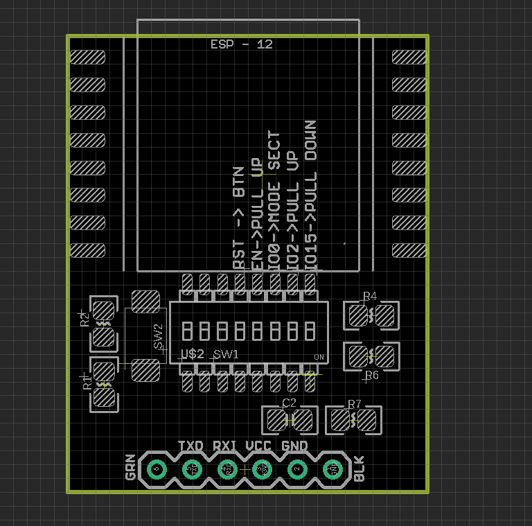

# DPR1106 dat 

https://www.electrodragon.com/product/esp-12-programmer-debugger/

SMD Switch from left to right 

| Pins | function        | Default   |
| ---- | --------------- | --------- |
| 1    | -               | -         |
| 2    | -               | -         |
| 3    | -               | -         |
| 4    | Reset           | pull up   |
| 5    | EN              | pull up   |
| 6    | IO0, Flash Mode | pull up   |
| 7    | IO2             | pull up * |
| 8    | IO15            | pull down |

* IO0 pin = switch off to pull down to flash mode
* \* (not necessary)

