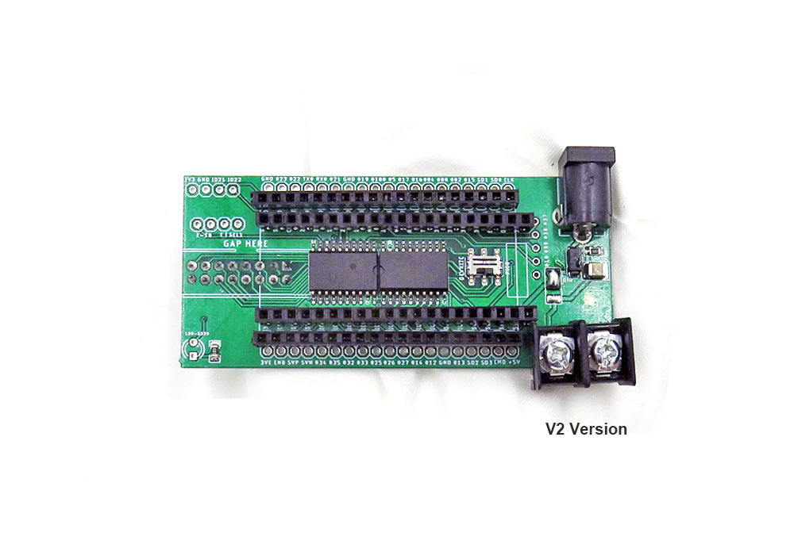
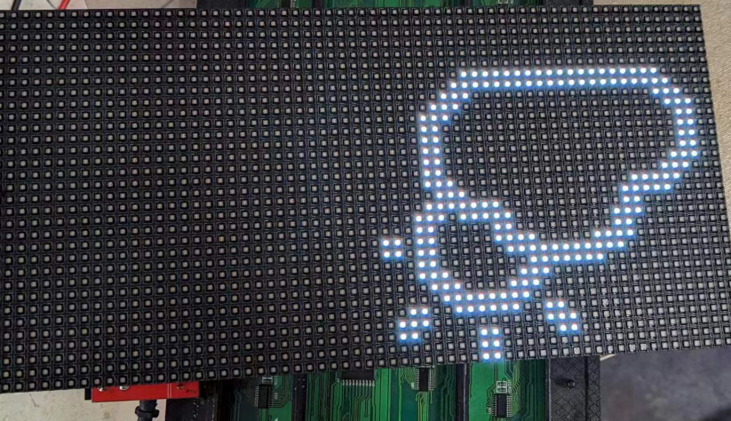

# IDD1013 DAT

## info 

- DMA version 
- https://w.electrodragon.com/w/ESP32_DMA_RMP
- https://www.electrodragon.com/product/rgb-matrix-panel-drive-interface-board-for-esp32-dma/

## Versions:

Current V2 
- Add logic shifter to shift from signals from 3.3V to 5V
- Lead out alone I2C pin header 4pin
- Lead out alone light sensor IO34

Old V1 version:
- Lead out all pins for devkitc, but only used pins for driving matrix panel for PICO.

## Demos

- V2 version https://twitter.com/electro_phoenix/status/1635248053392375808

## hardware setup 

- swtich between DEVKitC or PiCO 
- Please notice for devkitc, CLK = IO16, D = IO17
- Please notice for PCIO, CLK = 32, D = 33

### Library Setup 

- lib: https://github.com/mrfaptastic/ESP32-HUB75-MatrixPanel-I2S-DMA
- tested sketch: https://github.com/Edragon/Arduino-ESP32/tree/master/Sketchbook/Matrix-panel/IDD1013

Please notice the library updated default setup file
- new setup file: esp32-default-pins.cpp
- old setup file: #include <ESP32-HUB75-MatrixPanel-I2S-DMA.h>

### DEVKITC Board pin definitions 

notice the differences of pin CLK and D

    #define R1_PIN_DEFAULT  25
    #define G1_PIN_DEFAULT  26
    #define B1_PIN_DEFAULT  27
    #define R2_PIN_DEFAULT  14
    #define G2_PIN_DEFAULT  12
    #define B2_PIN_DEFAULT  13

    #define A_PIN_DEFAULT   23
    #define B_PIN_DEFAULT   19
    #define C_PIN_DEFAULT   5
    #define D_PIN_DEFAULT   17 // pin for devkitc, for PCIO please go IO33
    #define E_PIN_DEFAULT   -1 // IMPORTANT: Change to a valid pin if using a 64x64px panel.
                
    #define LAT_PIN_DEFAULT 4
    #define OE_PIN_DEFAULT  15
    #define CLK_PIN_DEFAULT 16 // pin for devkitc, for PCIO please go IO32

### PICO Board pin definitions

    #define R1_PIN_DEFAULT  25
    #define G1_PIN_DEFAULT  26
    #define B1_PIN_DEFAULT  27
    #define R2_PIN_DEFAULT  14
    #define G2_PIN_DEFAULT  12
    #define B2_PIN_DEFAULT  13

    #define A_PIN_DEFAULT   23
    #define B_PIN_DEFAULT   19
    #define C_PIN_DEFAULT   5
    #define D_PIN_DEFAULT   33
    #define E_PIN_DEFAULT   18 // IMPORTANT: Change to a valid pin if using a 64x64px panel.
            
    #define LAT_PIN_DEFAULT 4
    #define OE_PIN_DEFAULT  15
    #define CLK_PIN_DEFAULT 32

### setup for matrix size 

/*--------------------- MATRIX LILBRARY CONFIG -------------------------*/
#define PANEL_RES_X 64      // Number of pixels wide of each INDIVIDUAL panel module. 
#define PANEL_RES_Y 32     // Number of pixels tall of each INDIVIDUAL panel module.
#define PANEL_CHAIN 1      // Total number of panels chained one to another

### ENV 
- [[arduino-IDE-DAT]] - 1.8.19
- lib - version 3.0.5
- esp32 2.0.6

### note

- Tedted with a 32 x 64 panel or 32 x 32 
- 64 x 64 will need to setup E-line
- result 

- [[IDD1013]]