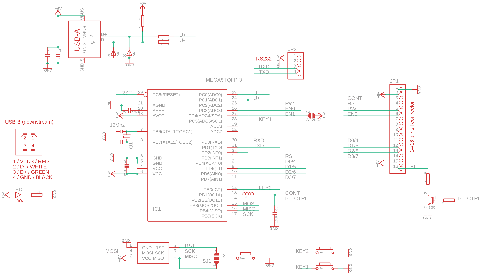

# ILC1073 dat 

## Info 
* Automatically support 1602 or 2004 type [char LCDs](https://w.electrodragon.com/w/Category:Char_LCDs)

* Install USB-driver libusb-win32 - [[usb-dat]]

https://www.electrodragon.com/product/1602-lcd-usb-mini-drive-board-rpi-driver-free/

## hardware 

Schematic 

- 2-way jumper connect the button to MISO or Reset 
- 1-way jumper connect PC4 (EN1) to +5V

- Programmer Buttons Key1 and Key2

## Software 

### Use on Windows : 

- https://github.com/harbaum/LCD2USB/blob/master/contrib/LCD2USB-smartie.zip
- libusb-win32 need to be installed 

### Firmware flash command

    avrdude -c usbasp-clone -p m8 -U flash:w:"E:\Git-category\Git-AVR\AVR_firmware\Firmware\LCD2USB\firmware.hex":a -U lfuse:w:0x9F:m -U hfuse:w:0xC9:m 

method 2 

    avrdude -c usbasp -p atmega8 -U lfuse:w:0x9f:m -U hfuse:w:0xc9:m -U flash:w:firmware-avrusb.hex

### Debug 

- tune the brightness if nothing show up
- contrast is also set in default firmware, pre-uploaded

## Demos 

Need to set contrast 
- https://twitter.com/electro_phoenix/status/987251467861061632

## ref 

- origin project - https://github.com/harbaum/LCD2USB
- python library - https://github.com/xyb/lcd2usb
- [[avrdude-dat]]