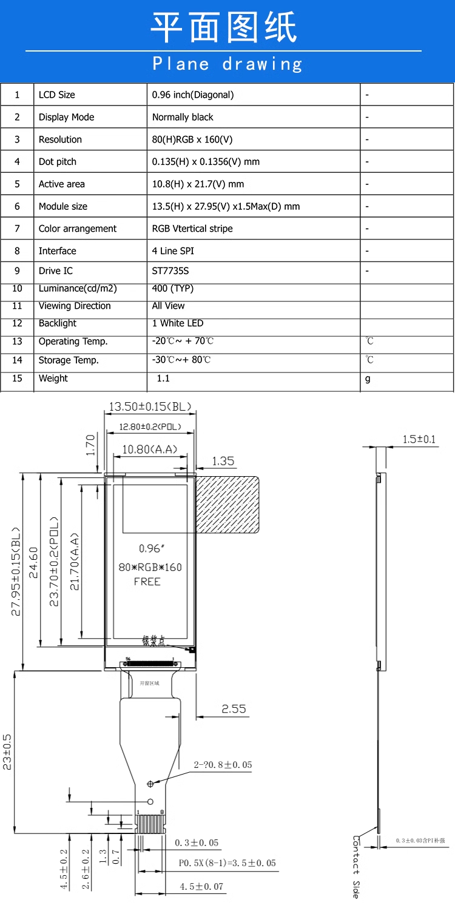
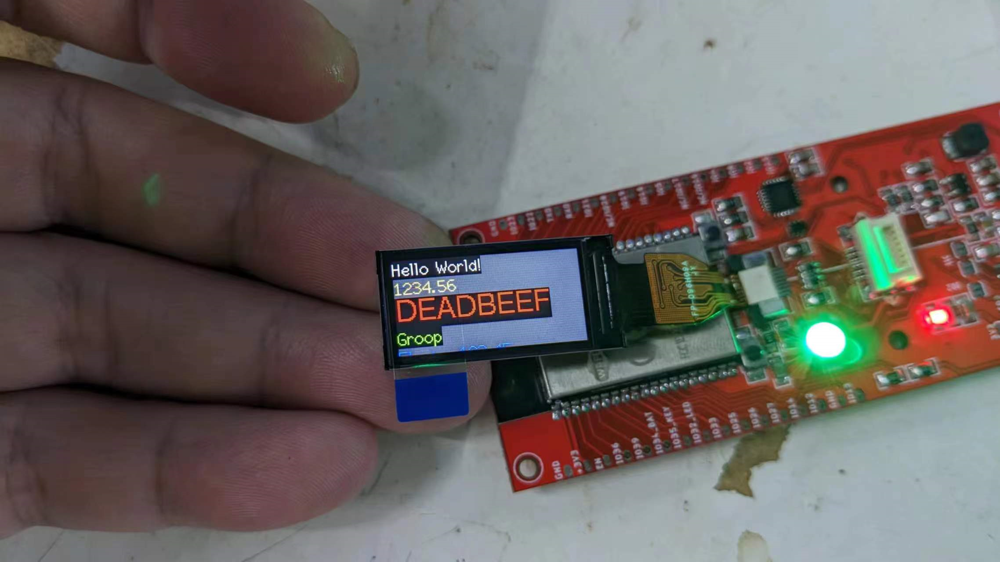

# ILC1075 dat 

IF09

1. LEDA - 3V3
2. GND - GND
3. RESET - ESP32_IO23 - RST
4. RS - ESP32_IO4 - DC
5. SDA - ESP32_IO19 - MISO
6. SCL - ESP32_IO18 - SCLK
7. VDD - 3V3
8. CS - ESP32_5 - CS

- [[ESP32-SPI]]
  
driver ST7735S
interface SPI 4-lin
resolution 80 x 160
type high-resolution IPS LCD
connection: soldering

- [[ILC1075-dat]] - [[ilc1078-dat]] - [[fpc-dat]]

- FPC-8P

- [[ILC1075]]

## Code 

- [[ILC1075-dat]] - TFT_eSPI arduino library - #include <custom/ST7735-096.h>

- [[arduino-display-dat]]
- test sketch - TFT_Print_Test

Config

    #define ST7735_DRIVER      // Define additional parameters below for this display

    #define TFT_WIDTH  80
    #define TFT_HEIGHT 160

    // #define ST7735_INITB           // not working
    // #define ST7735_GREENTAB        // not working
    // #define ST7735_GREENTAB2       // not working
    // #define ST7735_GREENTAB3       // not working 
    // #define ST7735_GREENTAB128     // not working  
    #define ST7735_GREENTAB160x80  // OK2  
    // #define ST7735_REDTAB          // not working
    // #define ST7735_BLACKTAB        // not working
    // #define ST7735_REDTAB160x80    // OK1  

    // #define CGRAM_OFFSET      // Library will add offsets required

    #define TFT_MOSI 19
    #define TFT_SCLK 18
    #define TFT_CS    5  // Chip select control pin
    #define TFT_DC    4  // Data Command control pin
    #define TFT_RST  23  // Reset pin (could connect to RST pin)

## Demo 

