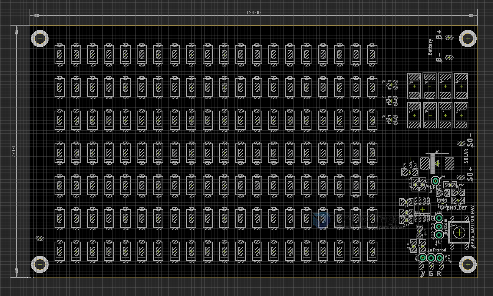
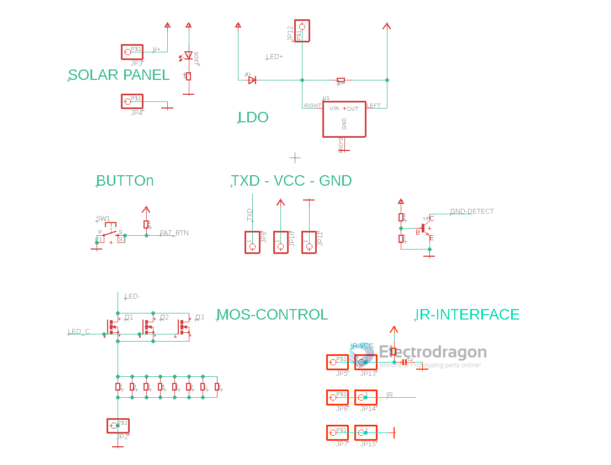
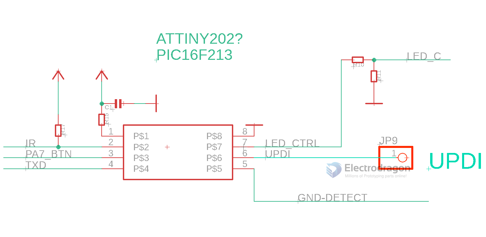

# ILE1073-dat

## hardware 

## Pin Definitions 

Solar Panel Input = un-regulated higher DC input
- SO+
- SO-

Infrared Control
- V = VCC
- G = GND
- R = Infrared input 

Battery In  
- B+ = LED+
- B- = GND

Other Pins 
- TXD/VCC/GND - debug only 
- UPDI - flash chip 

## Power Supply 

- SO+ via diode to B+/LED+
- B+/LED+ via LDO to system VCC

## LED Drive

- On low side mosfet 

## Chip Pin Definitions 

