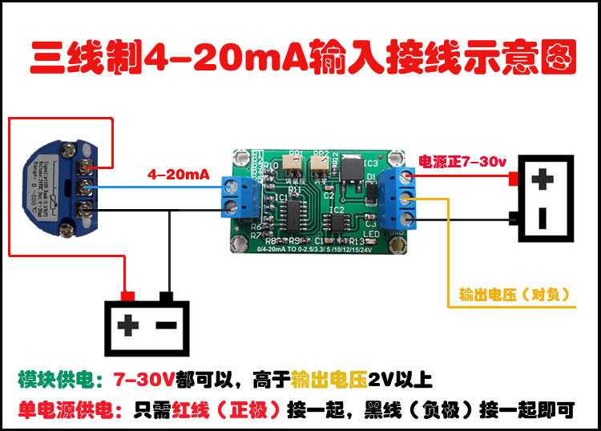
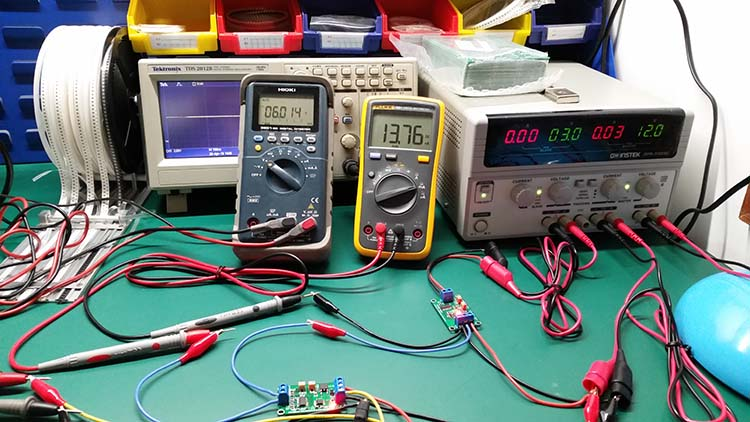

# ITF1006-DAT

## Pins 

https://www.electrodragon.com/product/current-loop-to-analog-voltage-converter-4-20ma-to-0-5v/

## Use Guide 

### two pin load wiring 

#### Single Power Supply 
- All input power from three-pin terminal VCC GND pins 
- yellow pin for output voltage read
- module power supply 7-30V, 2V higher than output-side

#### seperated Power Supply 
- Further add power supply on two-pin measure-target side 

### three pin load wiring

### Tests 

