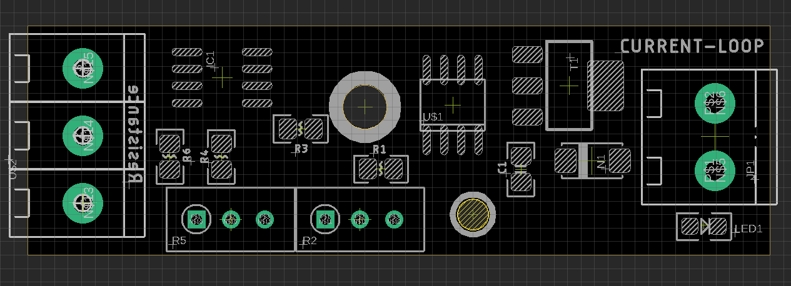

# ITF1003-DAT

- tune R5 for minimium current loop value to 4 mA
- ture R2 for maxmium current loop value to 20 mA

check LED brightness to get visual feedback of the current

DC 9-36V input

read current value on the right side 

## Tune Calibraction 
- prepare a trim pot, tune to maximium level, for example a 1K trim pot, one side 0R, another side 1K
- please follow the step below 
- a current meter is helpful to check the right side output current 

| step | action on                    | target |
| ---- | ---------------------------- | ------ |
| 1    | RIGHT side on board trim pot | 20 mA  |
| 2    | LEFT side on board trim pot  | 4  mA  |

- now you can tune the input resistance to check output current 
- notice active input resistance are the middle and bottom pins (left side terminal)

## ref 
- [[ITF1003]]

