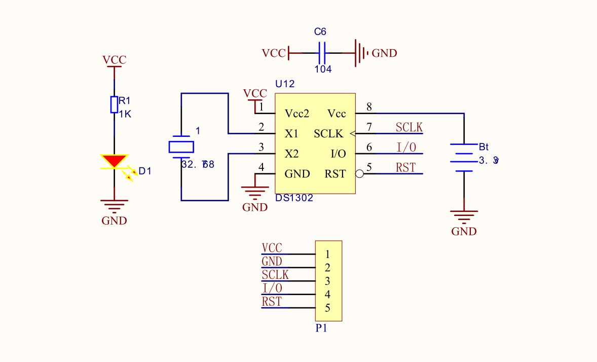

# MOT1009 DAT

## wiring for STM32

- VCC → +5V/3.3V
- GND → GND
- SCLK → P36
- I/0 → P34
- RST → P35

## hardware 
battery holder CR1220

## ref 
- [[DS1302-DAT]]
- arduino library "RTC by makuna"

