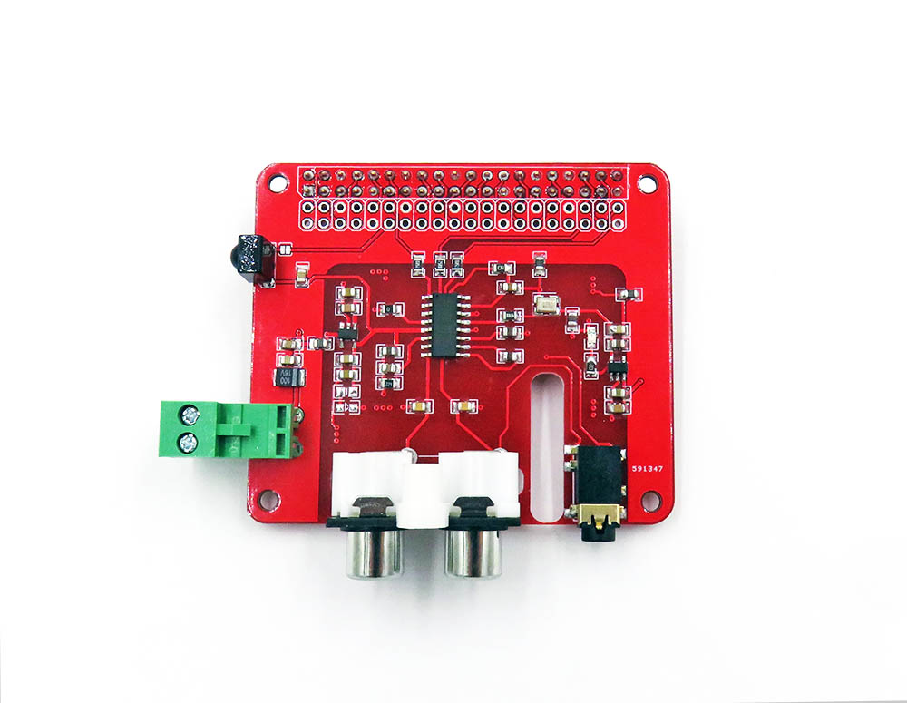

# MPC1111 DAT

## ref 
- https://www.electrodragon.com/w/Sound_Card#Use_PCM5102_or_ES9023_w.2FRPI
- [[volumio]]

| RPI  | ES9023                           |
| ---- | -------------------------------- |
| SCK  | Not wired (Internally generated) |
| BCK  | PIN 12    (GPIO18)               |
| DIN  | PIN 40    (GPIO21)               |
| LRCK | PIN 35    (GPIO19)               |
| GND  | PIN 6     (GND)                  |
| VIN  | PIN 2     (5V)                   |