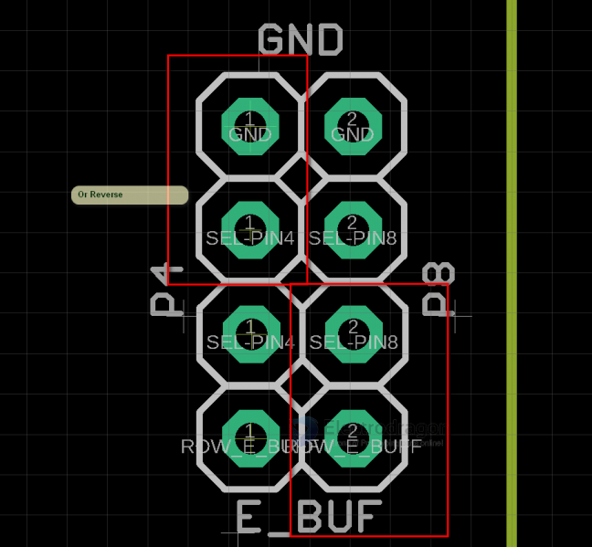
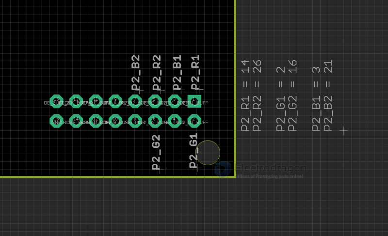
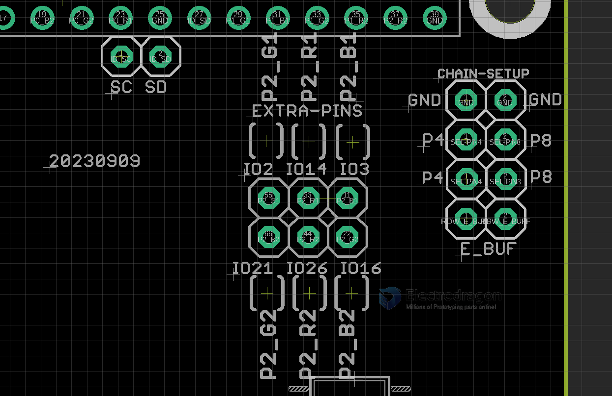

# MPC1119 DAT

First version please see here. [[MPC1073-dat]]

New features please see the right image 
* Remove the right chip to free extra GPIOs
* Connect PIN4 or PIN8 to E_BUF for E-line
* Power input and output from the left large pin connectors

## pin definitions 

The following two GPIOs are not used at all and free:
- pin SC to raspberry pi pin ID_SC
- pin SD to raspberry pi pin ID_SD

Extra pins Used by Chain P3:
- to use the extra pins, you need to cut the jumpers to release them from the chip below, and chain P3 can not be used anymore. 

Debug Port: 
- RX | GND (some boards mark could be reversed): UART_RX debug, or ROW_E set to ground 

## Wiring

- If you supply power to matrix panels separately, the converter board MPC1119 will be power supplied by pins, no need extra power supply. 
- If you supply all power from one port on the converted board, you can connect the power supply to matrix panels from another port.
- Voltage should be no more than 5.5V.

## Extra Pins

- Please note there is a wrong typo on the board, IO12 should be IO14 
- top pins: IO2 IO12 IO3
- bottom pins: IO21 IO26 IO16

### Legacy Wiki 

- RMP Guide - https://w.electrodragon.com/w/RPI_RMP_Guide#P3/P4_64x64_(tested)

- [[MPC1073-DAT]] - [[MPC1119-DAT]]

## E-line Setup, Extra GPIOs Pin Definitions

Setup E-line, PIN4 to E, PIN8 to GND or vice vese.

Chain-3 5V logic output pin definitions

3V3 direct lead pin definitions

## ref 

- [[MPC1119]]