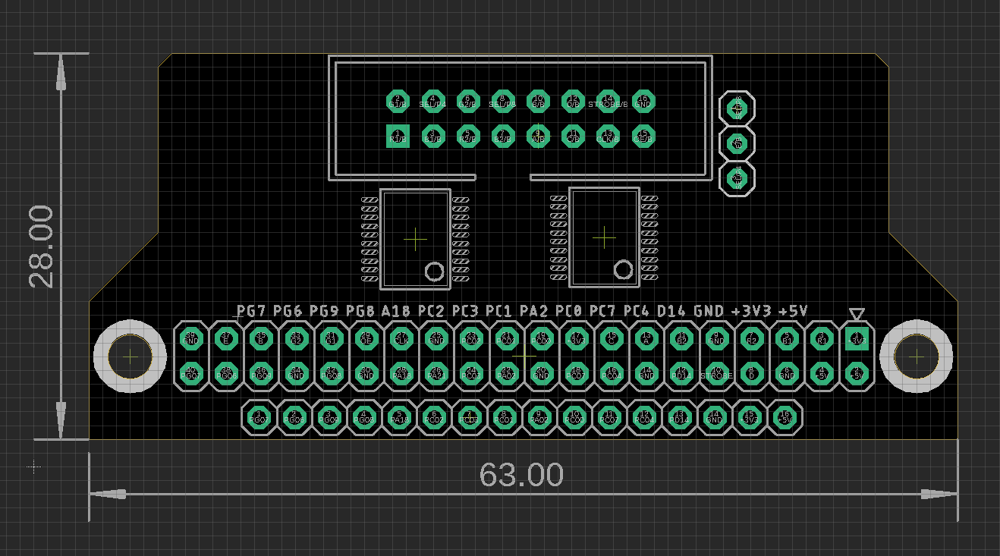

# OPI RGB LED Matrix Driver Board for Orange Pi PC

- relevant git - https://github.com/mrfaptastic/opi-allwinner-h3-rgb-led-matrix

## Board Dimension

## Test Records

BTW: yesterday I tested the same pin connection and library with Orange Pi PC2 (Allwinner H5), and it works fine without problems

Orange Pi PC2 with Allwinner H5 Soc is much faster than Orange Pi PC with Allwinner H3 Soc

So, the same drive board can work with both Orange Pi boards