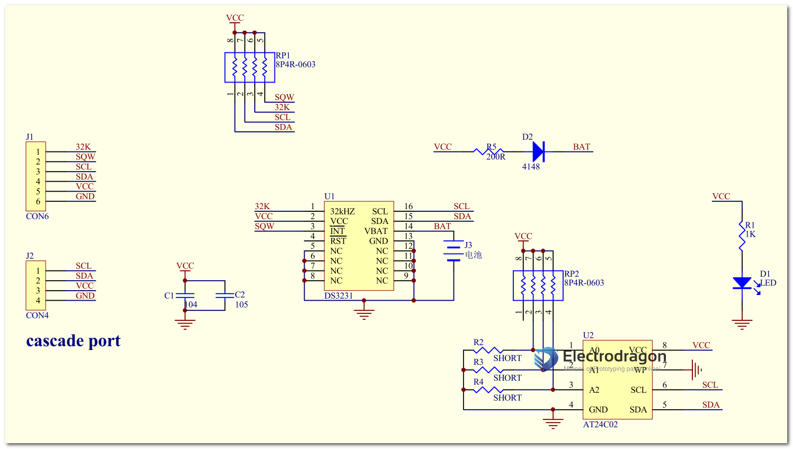

# MSP1043-dat 

## Features: 

1. Size: 38mm (length) * 22mm (width) * 14mm (height)
2. Weight: 8g
3. Working voltage: 3.3--5.5V
4. Clock chip: high-precision clock chip DS3231
5. Clock accuracy: within the range of 0-40℃, the accuracy is 2ppm, and the annual error is about 1 minute.
6. Comes with 2 calendar alarm clocks
7. Programmable square wave output
8. The real-time clock generates seconds, minutes, hours, day of the week, date, month and year, and provides leap year compensation valid until 2100.
9. The chip has its own temperature sensor with an accuracy of ±3°C.
10. Memory chip: AT24C32 (storage capacity 32K)
11.IIC bus interface, maximum transmission speed 400KHz (when the working voltage is 5V)
1.  Other IIC devices can be cascaded. The 24C32 address can be modified by short-circuiting A0/A1/A2. The default address is 0x57
2.  With battery CR2032, it ensures that the clock will still run normally after the system is powered off.
3.  Packaging method: single anti-static packaging

## SCH 

## ref 

- [[DS3231-dat]]

- [[I2C-dat]]