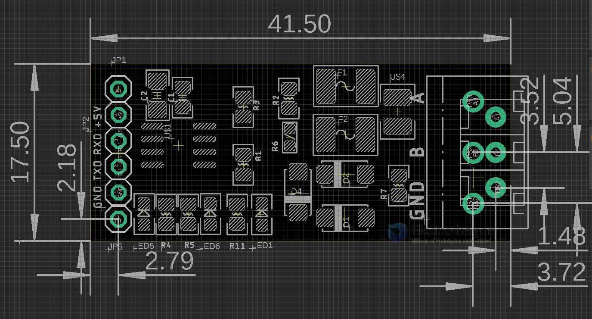
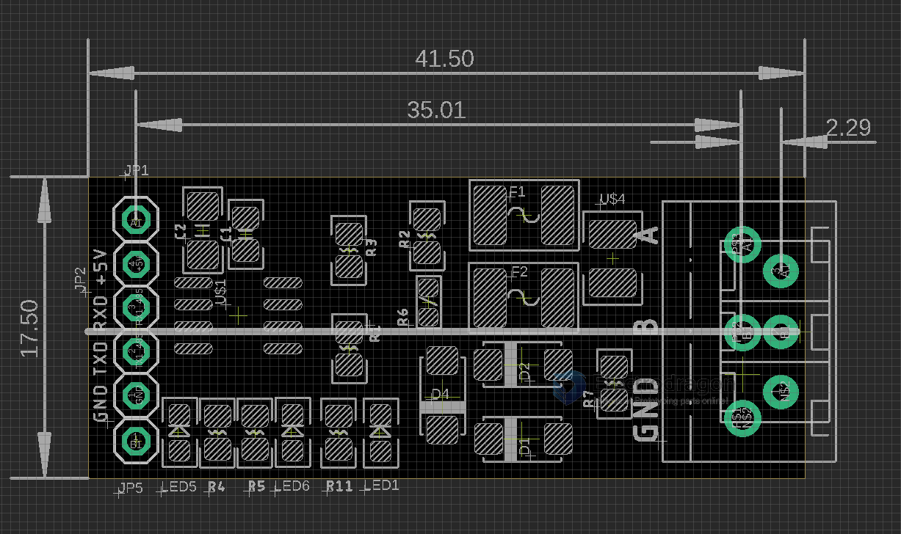
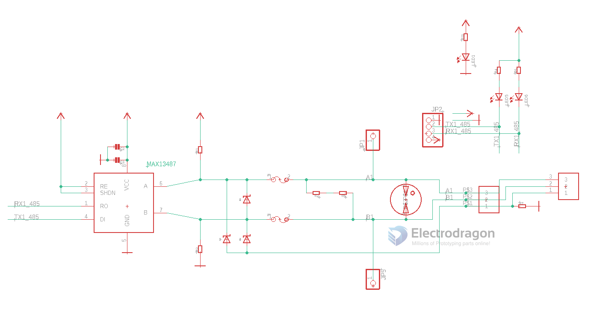

# MSP1076-dat

RS485 auto board 1 

## Board Features 

- TXD / RXD data indicator LEDs 
- Power LED
- Working voltage 5V, 3.3V may NOT work 
- Audo direction 
- Fine protections for most cases
- Output 3-pin headers, pitch compatible 3.5mm/5mm 
- 120R end terminal resistor 

## Pin Definitions 

Left Side Pins 
- A (not mark)
- 5V
- RXD
- TXD
- GND
- B (not mark)

Right Side Pins 
- A
- B
- GND

## On board Protections 

- TVS 
- Fuse 
- Lightning protection

## schematic 

## ref 

- demo video and other protocols documentation please see here [[interface-dat]] 

- [[msp1076]] - [[MAX13487-dat]]

- [[eagle-cad-dat]]