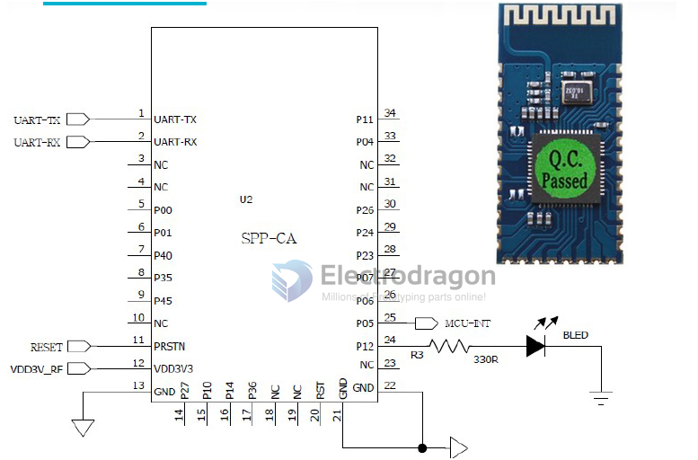
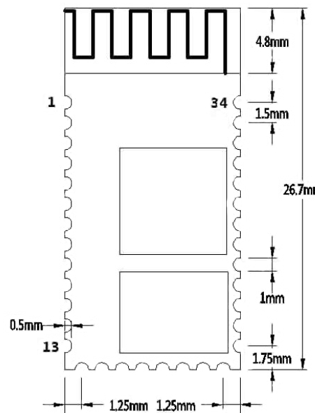

# NBL1012-dat

- [legacy wiki page.](https://w.electrodragon.com/w/BK3231)

## SCH

- P12: Blink to indicate it is waiting for pairing, On to indicate paired.
- P05: MCU interruption, low to interrupt the connection from MCU.

## AT commands

- AT COMMANDs only works when module is not connected for cofiguration only.

- Must add CR and LR (\r\n) for each command
- High/low character not sensistive

- Baudrate supports 1200,2400,4800,9600,14400,19200,38400,57600,115200,230400,460800 and 921600bps。

| Command                     | Description            | Examples                      | Parameters            |
| --------------------------- | ---------------------- | ----------------------------- | --------------------- |
| AT                          | Test                   | -                             |                       |
| AT+Reset                    | Reset                  | -                             |                       |
| AT+VERSION                  | check firmware version | -                             |                       |
| AT+DEFAULT                  | Restore to default     | -                             |                       |
| AT+LADDR<Param> or AT+LADDR | set/check address      | AT+LADDR11:22:33:44:55:66\r\n |                       |
| AT+NAME<Param> or AT+NAME   | set/check device name  | AT+NAMEElectrodragon\r\n      |                       |
| AT+ROLE<Param> or AT+ROLE   | set/check device mode  | -                             | 0 = slave, 1 = master |
| AT+PIN<Param> or AT+PIN     | set/check              | -                             | default 1234          |
| AT+BAUD<Param> or AT+BAUD   | set/check baudrate     | -                             | \*                    |

- Note: 1---1200, 2---2400, 3---4800, 4---9600, 5---19200, 6---38400, 7---57600, 8---115200, 9---230400, A---460800, B---921600, C---1382400. Default：4---9600

## ref

- [[BK3231-dat]]

- [[NBL1012]]
