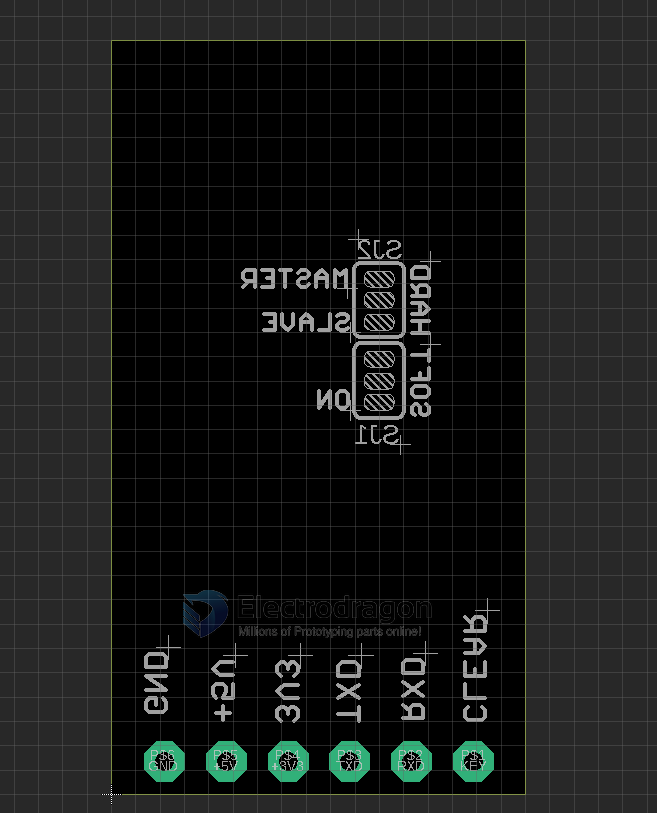

# NBL1022-dat

- [legacy wiki page](https://w.electrodragon.com/w/Category:BC-04)

## Base Board Pin Definitions

## Backside Jumper Setup Mode:

Bottom jumper set hardware / software method for slave / master mode, Default setup for hardware method.

| Jumper | Function         | Mode                      | Default |
| ------ | ---------------- | ------------------------- | ------- |
| SJ2    | master / slave   | hardware control M/S mode |
| SJ1    | soft / hard Mode | control mode select       | Hard    |

- Top jumper set for slave / master mode.
- If you prefer to use software method by AT commands to change slave / mater mode, cut the bottom jumper connection (GND - middle pin), then re-connect to top by solder (VCC-middle pin).

## Note 

Wiring 

- Board RXD -> target RXD, board TXD -> target TXD

## Demo Video 

- [Please see here.](https://www.youtube.com/watch?v=CmMGhHMciu8)