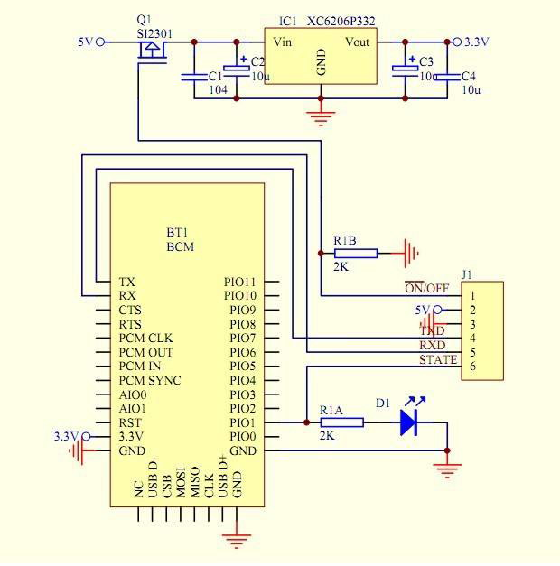
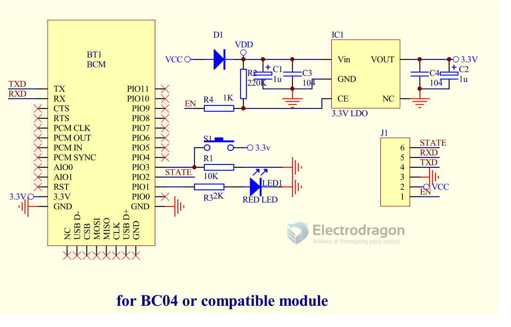

# NBL1022-dat

- [legacy wiki page](https://w.electrodragon.com/w/Category:BC-04)

https://www.electrodragon.com/product/lc-05-bluetooth-serial-moduel-masterslave-in-one/

## Features:

- BQB certificated 
- Master / Slave Mode supported 
- classic bluetooth easy to use 

## SCH 

## Base Board Pin Definitions

from left to right from front side 
- GND
- +5V
- 3V3
- TXD
- RXD
- Clear - clear the pairing status

## Backside Jumper Setup Mode:

Bottom jumper set hardware / software method for slave / master mode, Default setup for hardware method.

| Jumper | Function         | Mode                      | Default |
| ------ | ---------------- | ------------------------- | ------- |
| SJ2    | master / slave   | hardware control M/S mode |
| SJ1    | soft / hard Mode | control mode select       | Hard    |

- Top jumper set for slave / master mode.
- If you prefer to use software method by AT commands to change slave / mater mode, cut the bottom jumper connection (GND - middle pin), then re-connect to top by solder (VCC-middle pin).

## Note 

Wiring 
- Board RXD -> target RXD, board TXD -> target TXD

Mode
- Be aware default setting of the product is slave mode, communication only available between master and slave mode, but not master and master, or slave and slave mode.

## Demo Video 

- [Please see here.](https://www.youtube.com/watch?v=CmMGhHMciu8)

## ref 

- based on module - [[NBL1018-dat]]

- [[BC04-B-dat]] - [[HC05-dat]] - [[HC06-dat]]

- [[NBL1022]]