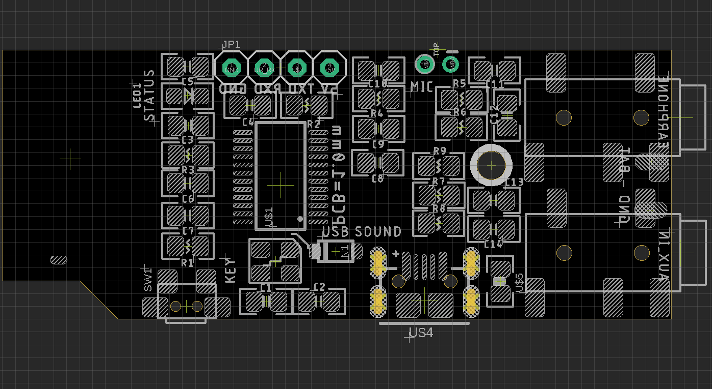

# NBL1089-DAT

## Pin Definitions 

- SW1: mode setup 
- JP1: debug only, no need to be used 
- GND - BAT: battery power supply
- MIC: Microphone solderin pins 
- USB: 
- LED1: status 
- Earphone 
- AUX_IN

## Note 

- Please notice microphone is not pre-soldered on board, you can do it yourself or add note to ask us to do it when you place order.
- More function is developing now, any updates we will update on wiki page. Also support customize.

## Demos 

* Pair with audio play box, and send human voice via speaker
* https://twitter.com/electro_phoenix/status/1114019811690856452
* Pair with audio play box, and PC -> audio -> AUX_IN to play
* https://twitter.com/electro_phoenix/status/1401807228126908429?s=20

- https://t.me/electrodragon3/159

## ref 

- https://w.electrodragon.com/w/EMBT-S02
- https://w.electrodragon.com/w/Category:EDMBT
- https://www.electrodragon.com/product/bluetooth-audio-transmitter-receiver-board-embt-s02/

