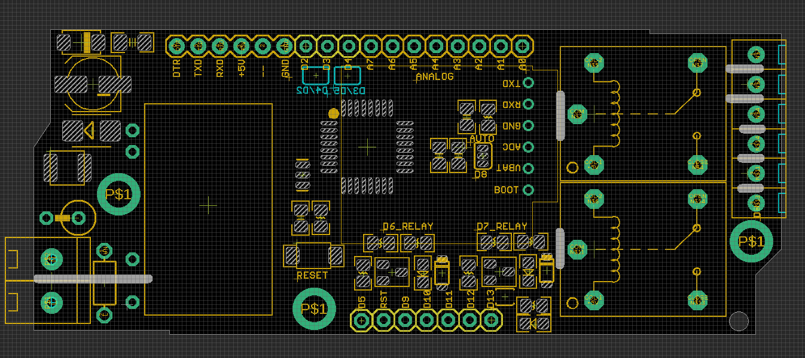

# NGS1072 DAT

- D2/D3 or D4/D5 Serial to SIM808
- D6/D7 - Relay
- D8 - SIM800 BOOT
- D13 - PROG LED

- FTDI FT232RL cable match programming pins on top-left: 
  - DTR TXD RXD +5V -- GND

## hardware Setup
- arduino pro mini 5V/16M
- SIM800 software serial port, selected by SMD jumper: D2 + D3 or D4 + D5 
- pull D8 pin to HIGH for at lease 2 seconds, and then LOW to boot SIM800 module 
    - SIM800 Network LED should start to link

## Demo Code 

- https://github.com/Edragon/Arduino-main/tree/master/Sketchbook/RF/NGS1072
- Please use as a refernece, the repository may need sort out.
