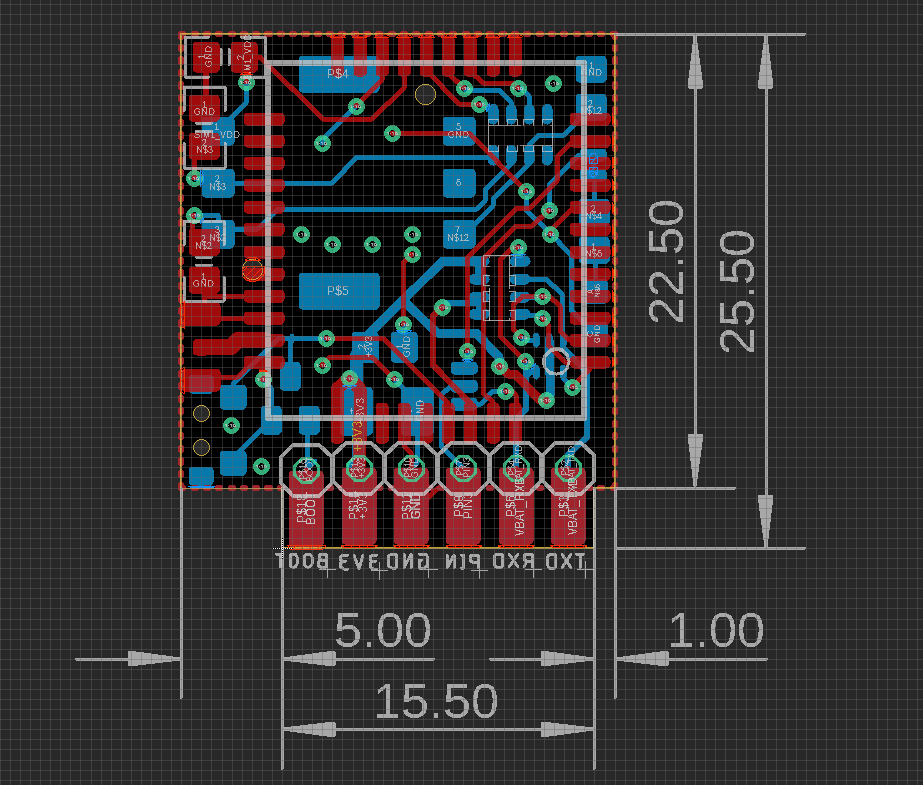
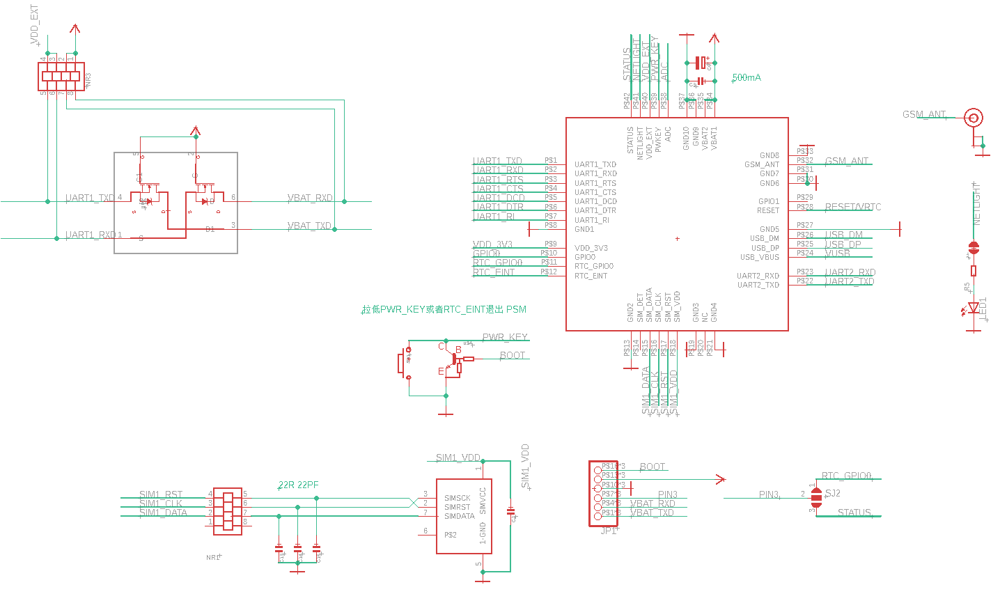

# Board Info 

### Pin Definitions 

BOOT 3V3 GND PIN RXD TXD

### Power supply 
- 3V3 500mA
- Logic level is the sme 3V3

### Common Debug Error

- you must use NBIOT Card, normal phone card may not work
- if the card no service, system will shut power at CREG 0,2

# PSM Mode 

- AT commands to enter into PSM power save mode 
- pull down RTC_EINT or PWR_KEY to quit PSM mode 

## Dimension / Pins / Schematic 

# reference 
- [[SIM7020-DAT]]
- [[low-power-test-dat]]