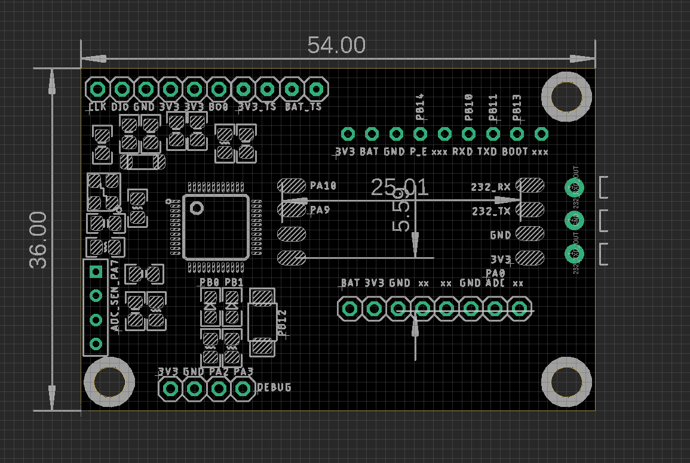
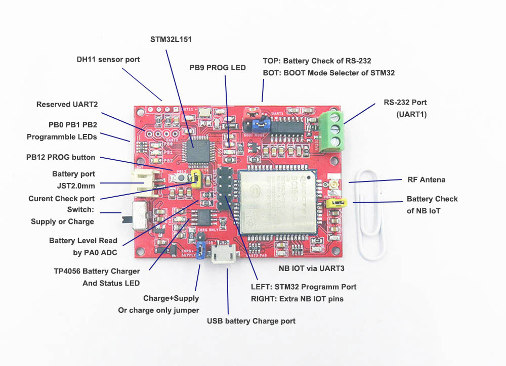

# NGS1111 DAT

### V2 Version

- pre-included board RS-232 [[DPR1084-DAT]]
- Optional stack board:
  - based on our current [[M2M-interface]]
  - SIM7020G
  - SIM7070
  - SIM7080

### V1 Version 

#### V1 Board Features: 

##### Support communicatoin via
BC35G NB IOT low power module
- Frequency Band: B1 / B3 / B5 / B8 / B20 / B28 (B28 is still developing)
- Cover many common frequency bands, but please check before order.
- Communicate via UART3 of STM32
- Jumper for checking power use.
- On board extra reserved pins
- SIM slot on back side of PCB board.
RS-232 Port
- Communicate via UART1 of STM32
- Jumper for checking power use.

##### Control by STM32L151 low power microcontroller
- Jumper for checking power use.
- PB0 PB1 PB2 PB9 programmable LED
- PB12 programmable button
- Reserved UART2 interface.
- Program SWD port.
- On board reserved DHT11 temperature sensor port via PA7

##### On board battery charger controller TP4056
- Charge via micro USB.
- Battery read via resistor divider by STM32 chip PA0 pin.
- All battery protection: over current, over voltage, etc.

#####  For Charge jumper and switch:
- For charge only: jumper - top, switch - top
- For battery power only: jumper - Any, switch - bottom
- For USB power only, removed battery: jumper - bottom, switch - bottom
- For USB power + charging battery together: jumper - bottom, switch - top

#### Demos V1

Documentation and demo:
- Demo video please see [here 01](https://twitter.com/electro_phoenix/status/1146673039972564992). or see [here 02](https://twitter.com/electro_phoenix/status/1145569540585271296).
- Demo free to use UDP server (receive data webpage demo) info [please see here](https://www.electrodragon.com/w/Server).
- Demo full projects please see in our github NBIOT folder (after purchase)