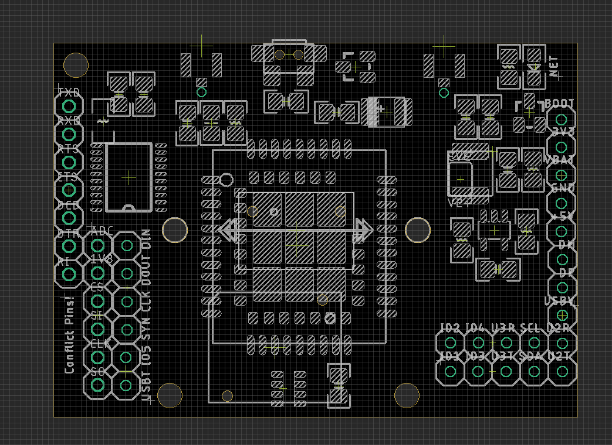

# NGS1128-DAT

## Hardware 

### V2 version 
- Simplified Connection: TXD / RXD / GND / VIN
- VIN: 4.2-18Vin
- default TXD / RXD logic at 3.3V
- Boot: hold down boot button for 2 seconds, or pull key pin to up for 2 seconds

### V1 version 

## Use Guide 

### boot the module 
- hold down the top-middle small button for 2 seconds to boot the module
- or pull the "boot" pin to high for 2 seconds to boot the module 

### Use as a Modem and COM PORT

- power via USB

### Use GNSS
- check at [[SIMCOM-AT-GNSS]]

## Demos
- Test with ESP32: https://twitter.com/electro_phoenix/status/1635565366595428352

## ref 

- Driver: [[git]] simcom_driver
- chip documentation: [[git]] SIMCOM_SIM70X0
- [[MQTT]]
- [[NGS1128]]
- [[SIMCOM-AT]]
- [[SIMCOM-AT-GNSS]]
- https://w.electrodragon.com/w/SIM7080