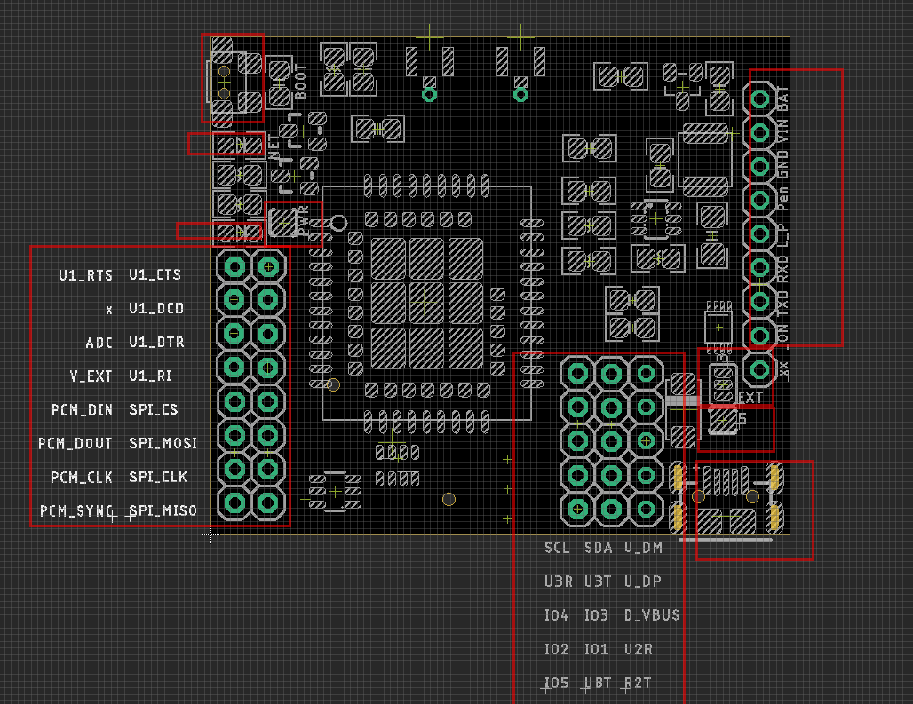

# NGS1129 DAT

based on chip [[SIM7080G-dat]]

## Hardware 

- Simplified Connection: TXD / RXD / GND / VIN
- VIN: 4.2-18Vin
- default TXD / RXD logic at 3.3V
- Boot: hold down boot button for 2 seconds, or pull key pin to up for 2 seconds
- on board netlight led and power led 
- manual reset module button 

### Wiring 
- VIN to 5~16 VDC
- GND to GND
- TXD - TXD
- RXD - RXD
- Logic_Power (L_P) to external 5V or NC if use internal 3V3 

#### Optionally: 
- BAT to directly battery power supply 
- Pen turn on board power on or off via enabling DC-DC regulator
- ON: turn on/off the M2M module 

### jumpers 

- PWR jumper: select ON/OFF for the power LED
- 3/5 jumper: select on board 3.3V or external logic/USB_5V power
- 5V jumper: 5V to external logic power pin 

- [[M2M-interface]]

## Use Guide 

### boot the module 
- hold down the top-middle small button for 2 seconds to boot the module
- or pull the "boot" pin to high for 2 seconds to boot the module 

### Use GNSS
- check at [[SIMCOM-AT-GNSS]]

### Use as a Modem and COM PORT

- power via USB

## test default 
- USB-TTL cable CH340/PL2303TA 
- 5V/GND/TXD/RXD works with internal 3.3V logic left

## Demos
- Test with ESP32: https://twitter.com/electro_phoenix/status/1635565366595428352

## ref 

- [[NGS1128-DAT]] - [[SY8120]]