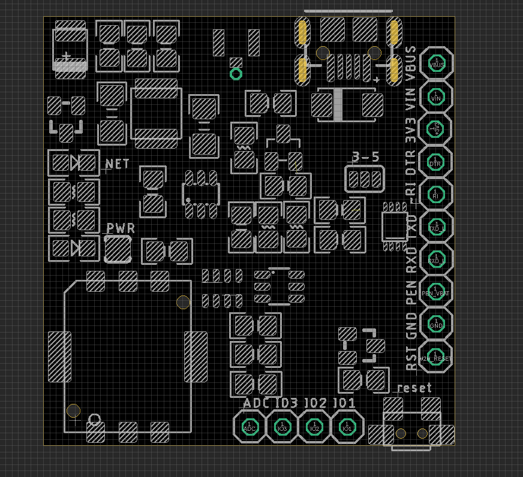
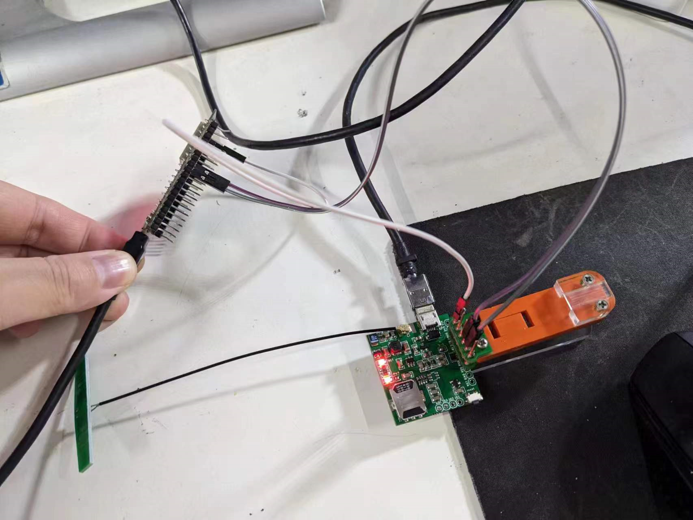

# NGS1131 DAT 

- [[A7670-DAT]]

## Hardware

- Hold down reset button for 2 seconds to boot the module 
- pull up   reset pin    for 2 seconds to boot the module (by external MCU)

### Pin Definitions 

- RST 
- GND 
- PEN 
- RXD 
- TXD
- ~RI 
- DTR 
- 3V3 
- VIN 
- VBUS

Note 
- When use VIN input, UART serial logic level power +5V should be supplied via VUSB
- 3.3V logic is supplied on board 

### Wiring UART communication with ESP32

| ESP32      | note         | A7670               |
| ---------- | ------------ | ------------------- |
| IO18 IO19  | UART         | A7670C              |
| Vin / Vusb | Logic Level  | A7670C logic        |
| Vin / Vusb | Power Supply | A7670C Power Supply |

## Hardware Design 

### Power Supply 

当模块在 LTE 模式下以最大功率发射时，电流峰值瞬间最高可达到 1A，从而导致在 VBAT 上有较大的电压跌落。为保证电压跌落小于 300mV，必须保证外部电源供电能力不小于 1A。

当电源能够提供 1A 的持续电流时，外部供电电容总容值，建议不小于 200uF；若不能提供 1A 的持续电流，则建议外部电容总容值不小于 600uF，以保证任何时候 VBAT 上电压跌落不超过 300mV。