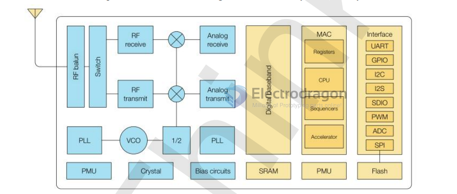
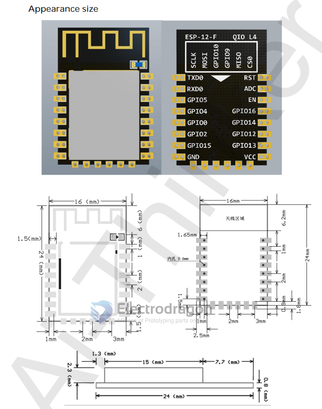
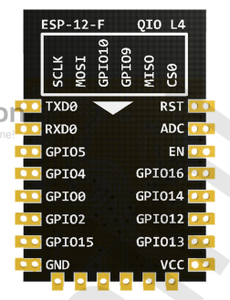
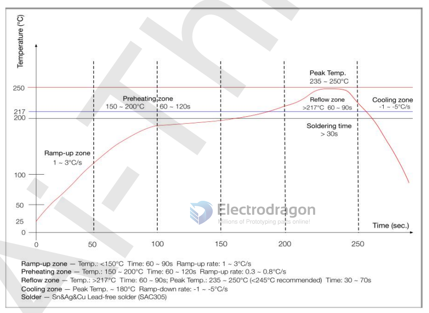
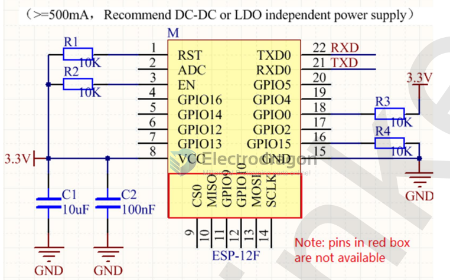
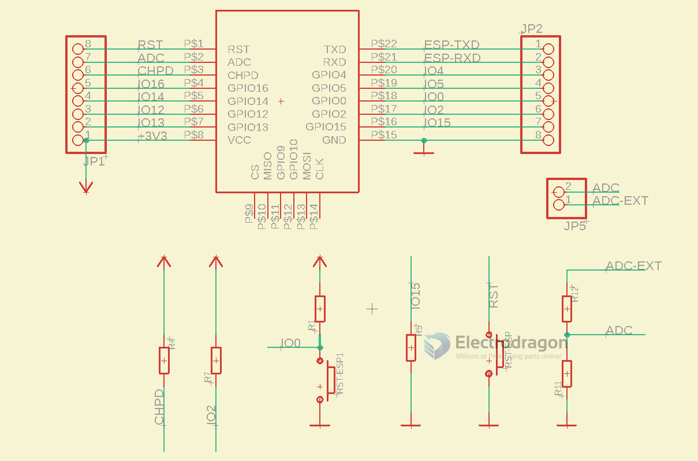
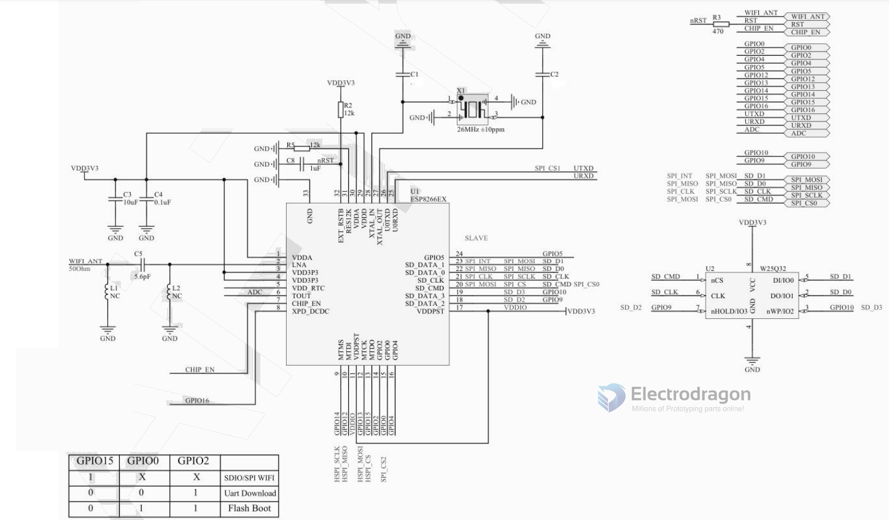
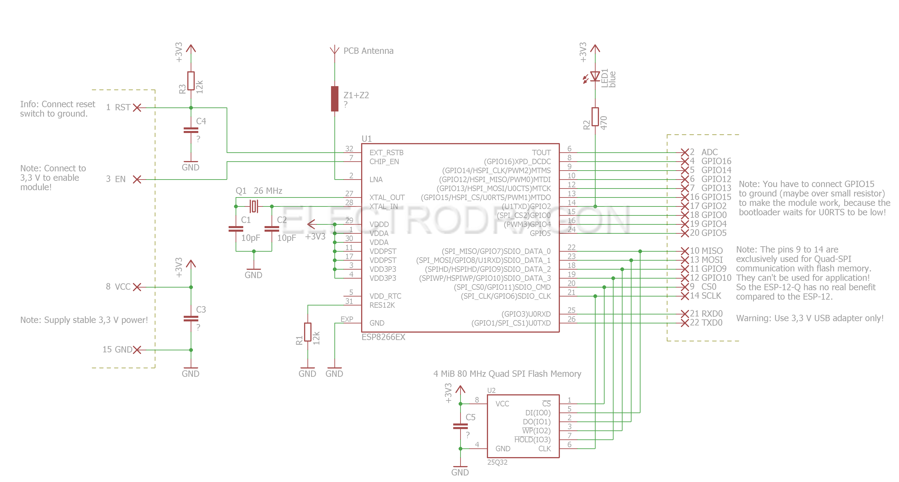

# NWI1059-dat

The ESP-12F WiFi module was developed by Ai-Thinker Technology. The core processor ESP8266 integrates the industry-leading Tensilica L106 ultra-low-power 32-bit micro MCU in a small package with 16-bit Lite mode, clocked at Supports 80 MHz and 160 MHz, supports RTOS, and integrates Wi-Fi MAC/BB/RF/PA/LNA.

The ESP-12F WiFi module supports the standard IEEE802.11 b/g/n protocol, a complete TCP/IP protocol stack. Users can use this module to add networking capabilities to existing devices or to build separate network controllers.

The ESP8266 is a high-performance wireless SOC that offers maximum utility at the lowest cost and unlimited possibilities for embedding WiFi functionality into other systems.

The ESP8266 is a complete and self-contained WiFi network solution that can operate independently or as a slave running on other host MCUs. The ESP8266 is capable of booting directly from an external flash memory when it is powered by an application and is the only application processor in the device. The built-in cache helps improve system performance and reduce memory requirements.

In another case, the ESP8266 is responsible for wireless Internet access. When it comes to the task of the WiFi adapter, it can be added to any micro controller-based design. The connection is simple and easy, just by SPI / SDIO interface or I2C / UART port. Just fine.

The ESP8266's powerful on-chip processing and storage capabilities allow it to integrate sensors and other application-specific devices through the GPIO port, minimizing system resources during minimal up-front development and operation.

## Dimension and Pins

## Features

- The smallest 802.11b/g/n Wi-Fi SOC module
- Low power 32-bit CPU, can also serve as the application processor
- Up to 160MHz clock speed
- Built-in 10 bit high precision ADC
- Supports UART/GPIO/IIC/PWM/ADC
- SMD-22 package for easy welding
- Integrated Wi-Fi MAC/BB/RF/PA/LNA
- Support multiple sleep patterns. Deep sleep current as low as 20uA
- UART baud rate up to 4Mbps
- Embedded LWIP protocol stack
- Supports STA/AP/STA + AP operation mode
- Support Smart Config/AirKiss technology
- Supports remote firmware upgrade (FOTA)
- General AT commands can be used quickly
- Support for the two development, integration of windows, Linux development environment Ai

## Product Specification

| Specs                  | -                                                                                                                                                  |
| ---------------------- | -------------------------------------------------------------------------------------------------------------------------------------------------- |
| Module Model E         | SP-12F                                                                                                                                             |
| Package                | SMD22                                                                                                                                              |
| Size                   | 24*16*3(±0.2)mm                                                                                                                                    |
| Certification          | FCCǃCEǃICǃREACHǃRoHS                                                                                                                               |
| SPI Flash Default      | 32Mbit                                                                                                                                             |
| Interface              | UART/GPIO/ADC/PWM                                                                                                                                  |
| IO Port                | 9                                                                                                                                                  |
| UART Baud rate Support | 300 ~ 4608000 bps ˈDefault 115200 bps                                                                                                              |
| Frequency Range        | 2412 ~ 2484MHz                                                                                                                                     |
| Antenna                | PCB Antenna                                                                                                                                        |
| Transmit Power         | - 802.11b: 16±2 dBm (@11Mbps) - 802.11g: 14±2 dBm (@54Mbps) - 802.11n: 13±2 dBm (@HT20, MCS7)                                                      |
| Receiving Sensitivity  | - CCK, 1 Mbps : -90dBm - CCK, 11 Mbps: -85dBm - 6 Mbps (1/2 BPSK): -88dBm - 54 Mbps (3/4 64-QAM): -70dBm - HT20, MCS7 (65 Mbps, 72.2 Mbps): -67dBm |
| Power                  | - (Typical Values) - Continuous Transmission=>Average˖~71mAˈPeak˖ - 500mA - Modem Sleep: ~20mA - Light Sleep: ~2mA - Deep Sleep: ~0.02mA           |
| Security               | WEP/WPA-PSK/WPA2-PSK                                                                                                                               |
| Power Supply Voltage   | 3.0V ~ 3.6VˈTypical 3.3VˈCurrent >500mA                                                                                                            |
| Operating Temperature  | -20 C ~ 85 C                                                                                                                                       |
| Storage Environment    | -40 C ~ 85 C , < 90%RH                                                                                                                             |

## Pin Definition

| No. | Pin Name | Functional Description                                              |
| --- | -------- | ------------------------------------------------------------------- |
| 1   | RST      | Reset Pin, Active Low                                               |
| 2   | ADC      | AD conversion, Input voltage range 0~1V, the value range is 0~1024. |
| 3   | EN       | Chip Enabled Pin, Active High                                       |
| 4   | IO16     | Connect with RST pin to wake up Deep Sleep                          |
| 5   | IO14     | GPIO14; HSPI_CLK                                                    |
| 6   | IO12     | GPIO12; HSPI_MISO                                                   |
| 7   | IO13     | GPIO13; HSPI_MOSI; UART0_CTS                                        |
| 8   | VCC      | Module power supply pin, Voltage 3.0V ~ 3.6V                        |
| 9   | GND      | GND                                                                 |
| 10  | IO15     | GPIO15; MTDO; HSPICS; UART0_RTS                                     |
| 11  | IO2      | GPIO2; UART1_TXD                                                    |
| 12  | IO0      | GPIO0;HSPI_MISO;I2SI_DATA                                           |
| 13  | IO4      | GPIO4                                                               |
| 14  | IO5      | GPIO5;IR_R                                                          |
| 15  | RXD      | UART0_RXD; GPIO3                                                    |
| 16  | TXD      | UART0_TXD; GPIO1                                                    |

## Boot Mode

Description of the ESP series module boot mode

| Mode          | CH_PD(EN) | RST  | GPIO15 | GPIO0 | GPIO2 | TXD0 |
| ------------- | --------- | ---- | ------ | ----- | ----- | ---- |
| Download mode | high      | high | low    | low   | high  | high |
| Running mode  | high      | high | low    | high  | high  | high |

- Notes: Some of the pins inside the module have been pulled or pulled down, please
  refer to the schematic diagram.

## reflow profile 

## peripheral schematic

Application circuit

- CHPD - pull up
- IO2 - pull up
- IO0 - pull up - press down button
- IO15 - pull down
- Reset - press down button
- ADC -voltage divider ladder

## SCH

