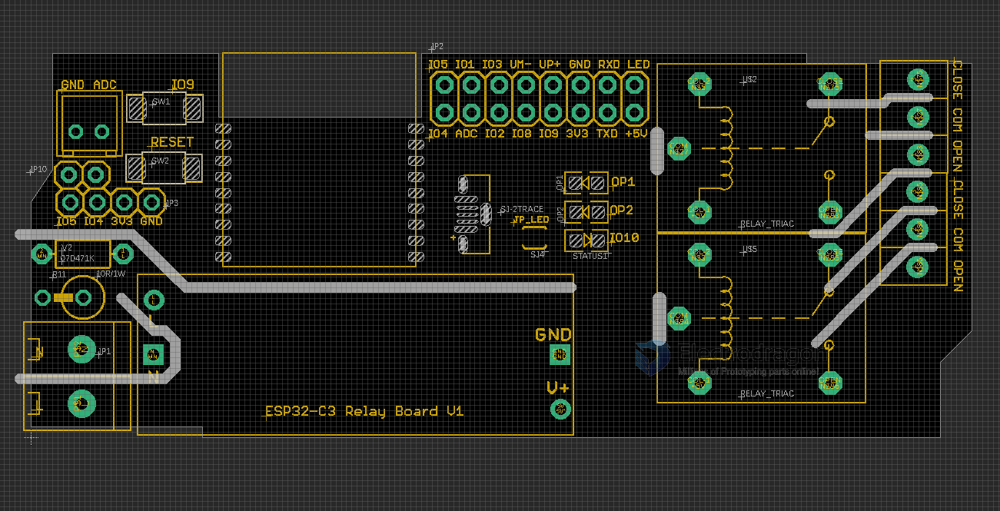

# NWI1118-DAT

### hardware 

#### R7 ESP32-C3 Version 

- programmerable LED IO10 
- programmerable / Flash Button IO9
- Reset Button 
- Relay Pin IO6 / IO7
- ADC Port Pin IO0
- Default Pull up IO2 IO8
- I2C Expand Pin Headers IO4 IO5 3V3 GND 

#### R6 
- IO2 = status LED (also on module ESP-12F)
- IO0 = BTN2
- RST = BTN1

#### R5 

- IO2 = BTN1
- IO0 = BTN2

- IO13 = relay 1
- IO12 = relay 2 
- IO14 = IO14
- IO16  = status LED
- IO4, IO5 = I2C Pull up 

## ref 

- [[ESP-SDK-dat]]

- [[ESP-12F-DAT]] - [[ESP32-­C3-­WROOM-­2-DAT]]
- [[AC-DC-SM]]
- code reference - [[NWI1139-DAT]]