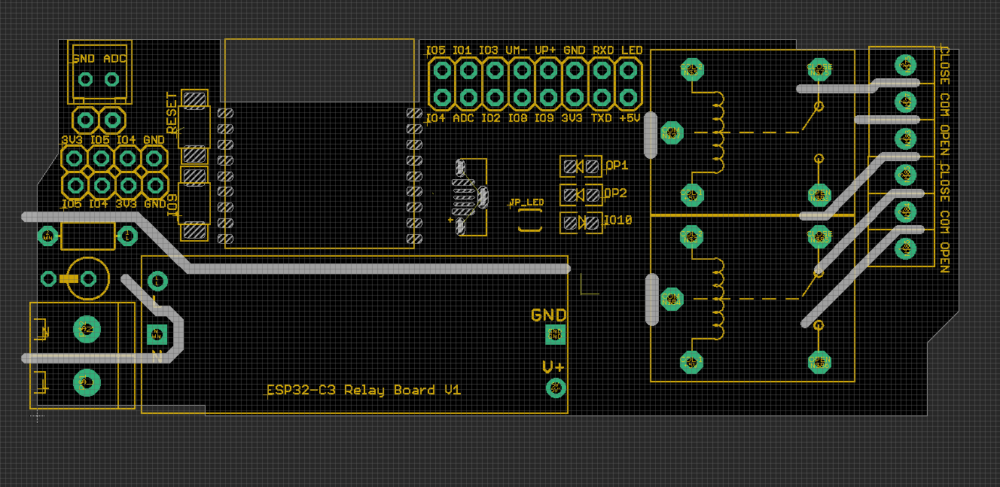

### Pin Definitions 

- IO0  - ADC
- IO2 / IO8 with pull-up on-board resistors for booting 
- IO4 / IO5 with pull-up on-board resistors for I2C
- IO6 - relay 1
- IO7 - relay 2

- IO09 - PROG Button 

- IO10 - on board LED, via jumper 

### note 
- [[ESP32-USB]] failed on code testing, may work or not, consider it is not working if you buy.

- bluetooth / wifi tested with official examples, https://github.com/Edragon/Arduino-ESP32

### demo video 

- https://www.youtube.com/watch?v=6Zk3WIVSvyM

### ref 

- [[ESP32-USB]]
- [[ESP32-C3-WROOM-02-DAT]]