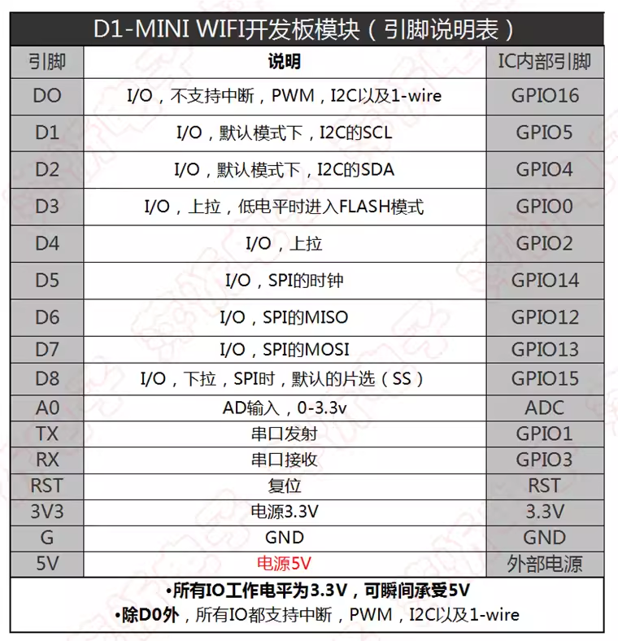

# NWI1122-dat 

https://www.electrodragon.com/product/d1-mini-pro-esp8266ex/

1. Based on ESP-8266EX
2. Arduino compatible, use Arduino IDE for programming
3. 11x I/O pins
4. 1x ADC pin (input 0-3.3V)
5. Support OTA online
6. Onboard 5V 1A switching power supply (maximum input 24V)

## pin definitions 

## ref 

- [[NWI1122]]
- https://w.electrodragon.com/w/Category:ESP8266_Boards