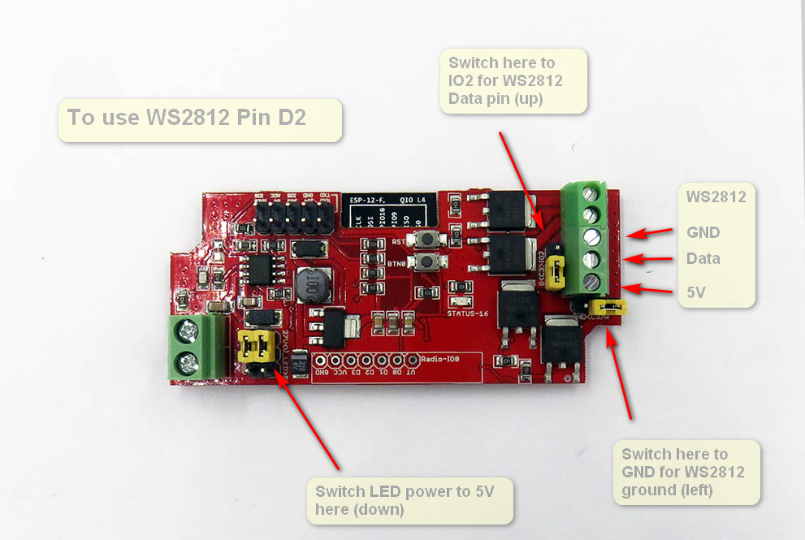
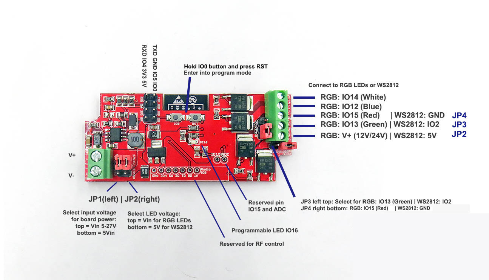
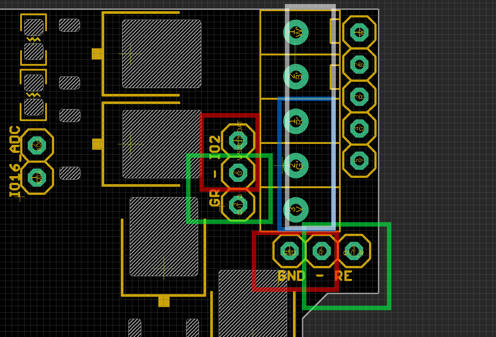
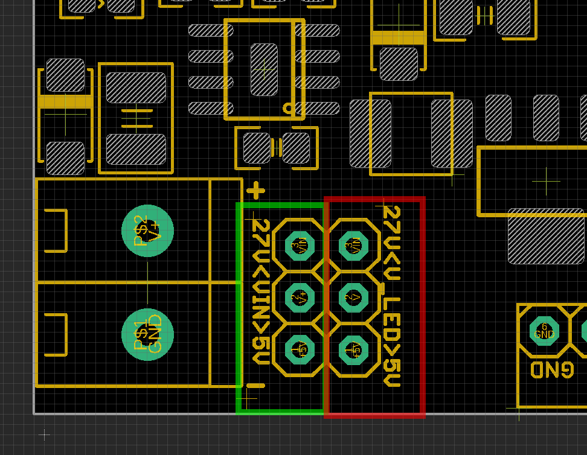

# NWI1124 DAT

## General Info 

- old wiki link: https://www.electrodragon.com/w/ESP_Light

## Pin Definitions 

#### Setup Explantion V2

### Output Control Setup 

based on above image, top pin 1 to bottom pin 5: 

#### Set both **RED** box jumpers

- pin 4 to IO2 for WS2812 data
- pin 3 to GND
- you will get blue box setup (from pin3 to pin5) from top to bottom
- from top to bottom = WS2812_GND, WS2812_DAT, WS_2812_5V

#### Set both **GREEN** box jumpers: 

  - pin 4 to Green channel of RGBW
  - pin 3 to Red   channel of RGBW
  - you will get white box setup (from pin1 to pin5) from top to bottom
  - White / Blue / Red / Green / Voltage Supply

### Power Supply Setup 

Green Box: 

- Set the input power supply for board. 
- choose 5V if input power is 5V, bypass the on board DC/DC converter
- Choose ~27V if input power is higher than 5V

Red Box: 

- Set to ~27V for RGBW LED Strips
- Set to 5V for WS2812 LED Strips

## Accessories 
- Reserved pins for our RF-LINK EDRF2 module here. (one channel trigger IO0 Low)
- https://www.electrodragon.com/product/rf-switch-receiver-433315mhz-wdecoder/

## Demos 
- https://www.youtube.com/watch?v=_kBS72xQPqQ
