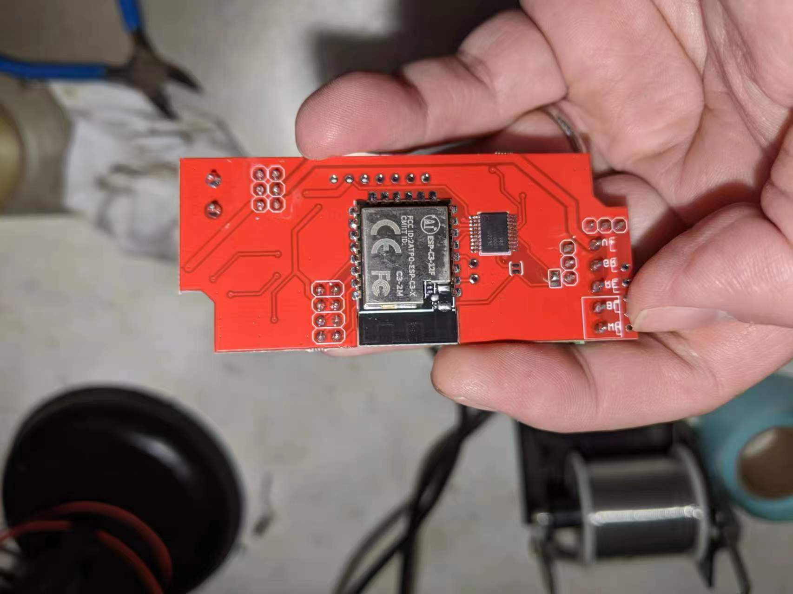
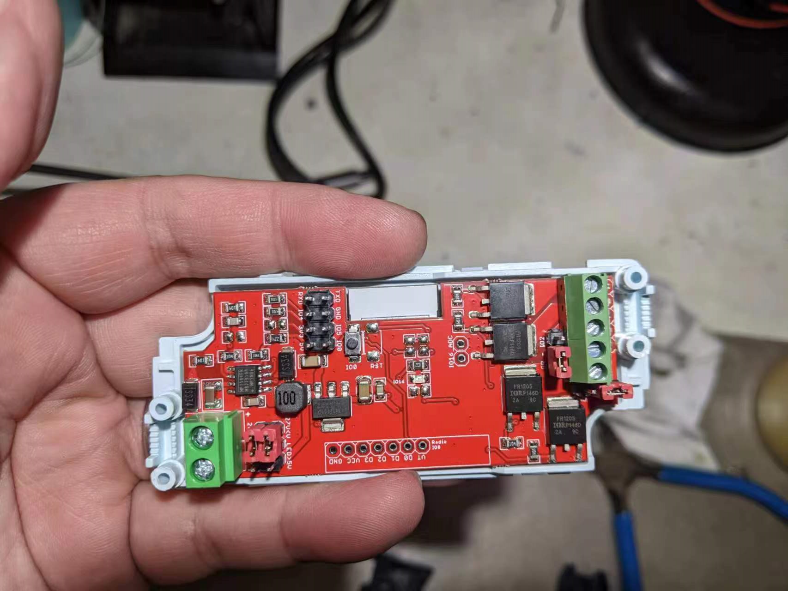

# NWI 1125

### look 

### modifications from NWI1124 -> NWI1125

- removed reset pin 
- removed IO 0  pull up
- removed IO 2  pull up
- removed EN    pull up 
- removed IO 15 pull down

### map pins 

- [[ESP-12F-DAT]]
- [[ESP-C3-12F-DAT]]

#### [[ESP-12F-DAT]] (nwi1124) = [[ESP-C3-12F-DAT]] (nwi1125)

  - IO12 = IO4 = Blue
  - IO13 = IO5 = Green
  - IO14 = IO3 = White
  - IO15 = IO8 = Red
  - IO02 = IO10 = WS2812 
  - IO00 = IO9 = RF

#### [[ESP-12F-DAT]] (nwi1124) = [[ESPC2-12-DAT]] (nwi112x)

side-left:
- RST - EN
- ADC - IO0
- EN - IO1
- IO16 - IO2
- IO14 - IO3 - white
- IO12 - IO4 - blue
- IO13 - IO5 - green 
- VCC  - VCC

side-right: 
- TXD - TXD
- RXD - RXD
- IO5 - IO18
- IO4 - IO10
- IO0 - IO9 - RF
- IO2 - IO7 - ws2812 
- IO15 - IO6 - red 
- GND - GND