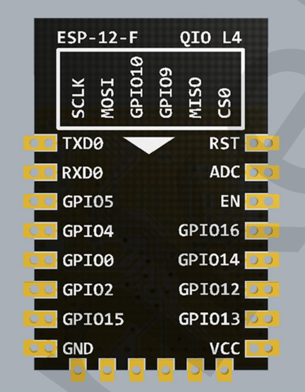
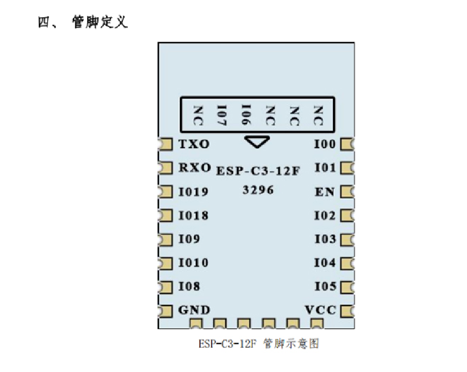

# NWI 1125

### look 

### modifications

- removed reset pin 
- removed IO 0  pull up
- removed IO 2  pull up
- removed EN    pull up 
- removed IO 15 pull down

### map pins 

ESP-12F (nwi1124) = ESP-C3-12F (nwi1125)

  - IO12 = IO4 = Blue
  - IO13 = IO5 = Green
  - IO14 = IO3 = White
  - IO15 = IO8 = Red
  - IO02 = IO10 = WS2812 
  - IO00 = IO9 = RF
