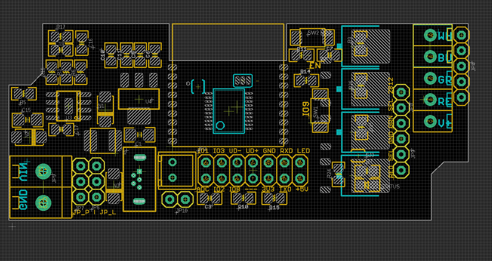
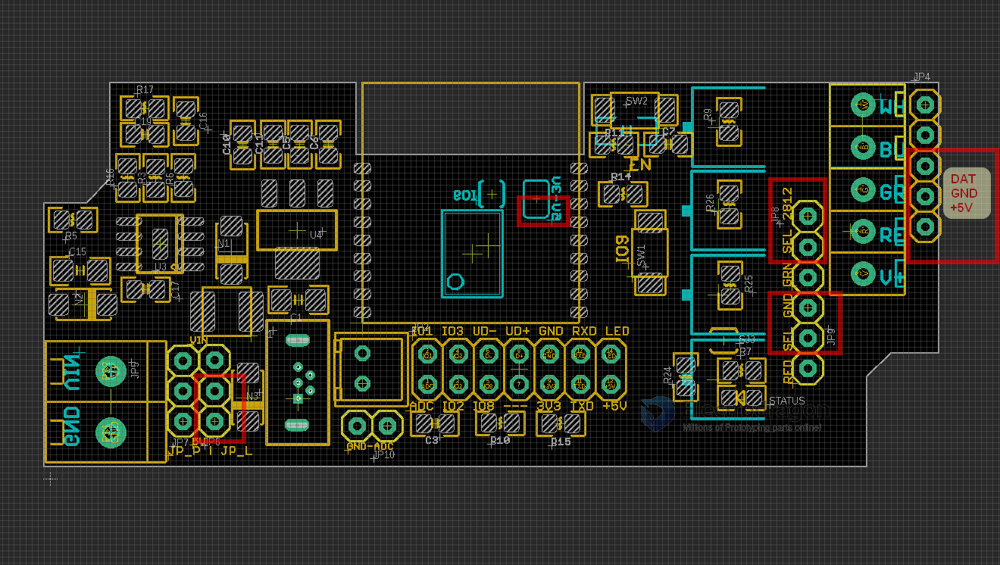
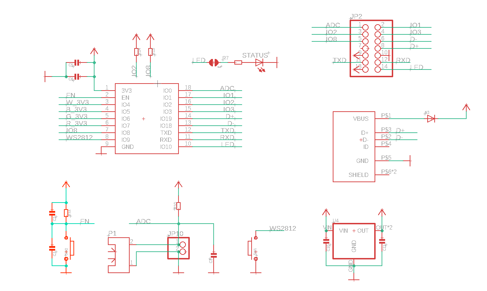
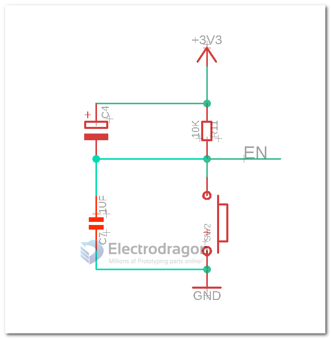

# NWI1126-DAT

## Pin Definitions

    #define OM_LED 10 // on module led
    #define WS_LED 9 // WS2812, select by jumper

    #define addc 0

    #define W_LED 4 // white
    #define B_LED 5 // blue
    #define G_LED 6 // green
    #define R_LED 7 //red

- IO9 button = program mode pin
- EN button = reset pin
- programmable LED pin 10

## Wiring Diagram

### Wiring for WS2812_5V

### Jumpers

| Jumper Name   | Option 1        | Option 2      | Function                                | Note    |
| ------------- | --------------- | ------------- | --------------------------------------- | ------- |
| JP_P          | 5V              | 6~28V         | board system power supply               |         |
| JP_L          | 5V              | 6~28V         | led strip power supply                  |         |
| JP 8 (top)    | ws2812_dat      | Green         | reused pins for WRGB channels or WS2812 |         |
| JP 9 (bottom) | ws2812_gnd      | Red           | reused pins for WRGB channels or WS2812 |         |
| back_jumper   | ws2812_dat_3.3V | ws2812_dat_5V | set ws2812 dat pin to 5V output default | default |

- for 12V or 24V led strips, put JP_L red box's jumper on top position
- back side jumper no need to change or check by default

- Programming guide please refer to page [[USB-TTL-dat]]

## Core Module Sch

Peripheral schamtic please refer to [[NWI1124-DAT]]

## quick test

- find demo code at https://github.com/Edragon/Arduino-ESP32
- find your board IP address, verify it in browser: http://192.168.8.165
- try the test commands to turn off on board prog LED: http://192.168.8.165/io/10/val/0
- in which, IO is 10 and IO voltage level is 0

## demo video

- https://twitter.com/electro_phoenix/status/1610204098019880961

## Note

- [[ESP32-USB-dat]] failed on code testing, may work or not, consider it is not working if you buy.

## Update Log

- New USB footprint to simplified the production process and reduce failure rate
- Tested USB Functions working fine by customers feedback

## custom only 

- C4 = 100uf/10V

## ref

- [[ESP32-­C3-­WROOM-­2-DAT]]

- [[NWI1124-DAT]]
- [[NWI1125-DAT]]
- [[NWI1126]]

- [[ESP32-DAT]]
