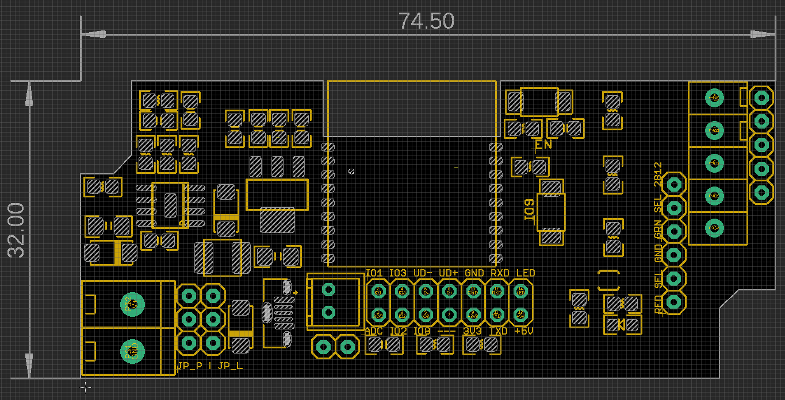

# NWI1126-DAT

    #define OM_LED 10 // on module led
    #define WS_LED 9 // WS2812

    #define addc 0

    #define W_LED 4 // white
    #define B_LED 5 // blue
    #define G_LED 6 // green
    #define R_LED 7 //red

## quick test 
- find your board IP address, verify it in browser: http://192.168.8.165
- try the test commands to turn off on board prog LED: http://192.168.8.165/io/10/val/0
- in which, IO is 10 and IO voltage level is 0

## Size Dimension Pin Definitions 

## demo video 
- https://twitter.com/electro_phoenix/status/1610204098019880961

## Note

- [[ESP32-USB]] may not work, not fully tested.

## ref 

- [[NWI1126]]