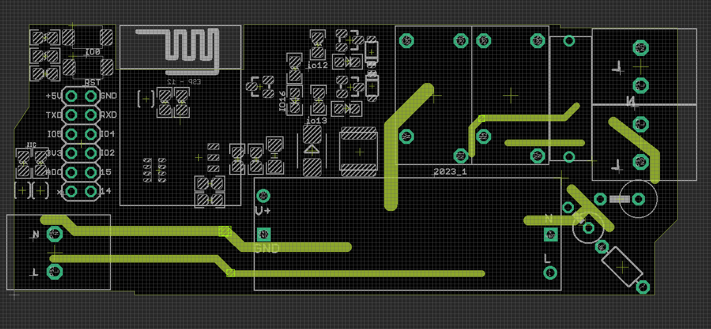

## Hardware 

    #define onModule_LED 2
    #define relay1 12
    #define relay2 13
    #define onBoard_LED 16

## AP demo code 

- hold down GPIO0 button and press reset button to enter into flash mode 

- https://github.com/Edragon/arduino-esp8266/tree/master/Sketchbook
- and into BSP folder - NWI1139

### control commands 

    192.168.4.1
    http://192.168.4.1/r11 # turn on relay1 to 1 
    http://192.168.4.1/m1 # turn on module led to 1  (GPIO2)
    http://192.168.4.1/b1 # turn on board led to 1  (GPIO16)

## ref 

- [[NWI1072-DAT]] - [[NWI1119-DAT]]