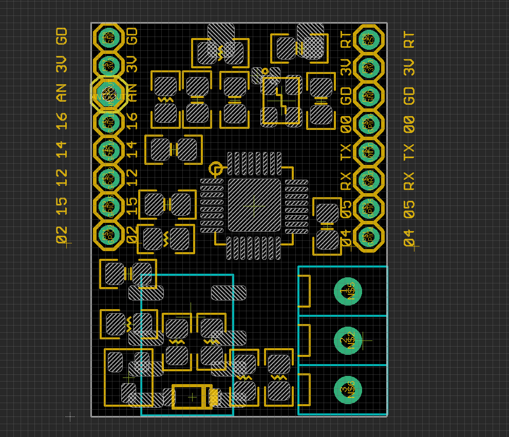

# NWI1173 DAT 

- socket input power supply 3.3V / GND 
- relay control IO13 
- relay output common-on - input - common-off

## ref 
- demo application - https://twitter.com/electro_phoenix/status/986505658727051265
- [[ESP8285-DAT]]

