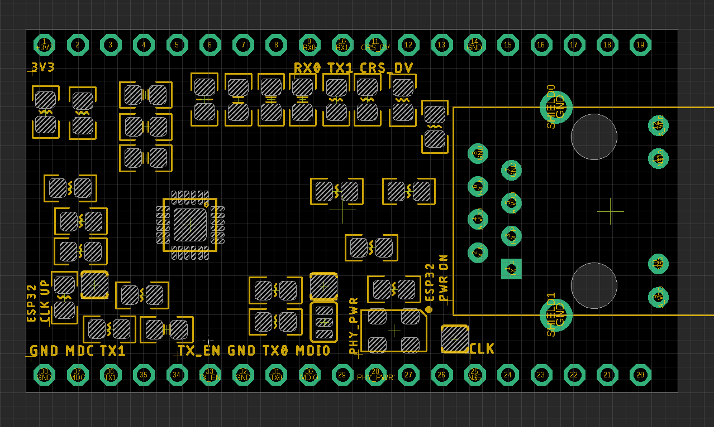

# NWI1199 DAT

- [[LAN8720-DAT]]

## hardware 

| ESP32   | func        | Ethernet          | Note         |
| ------- | ----------- | ----------------- | ------------ |
| GPIO 17 | PHY_POWER   | Osc_PWR (PHY_pwr) | obselete pin |
| GPIO 22 | EMAC_TXD1   | TX1               |              |
| GPIO 19 | EMAC_TXD0   | TX0               |              |
| GPIO 21 | EMAC_TX_EN  | TX_EN             |              |
| GPIO 26 | EMAC_RXD1   | RX1               |              |
| GPIO 25 | EMAC_RXD0   | RX0               |              |
| GPIO 27 | EMAC_RX_DV  | CRS               |              |
| GPIO 00 | EMAC_TX_CLK | nINT/REFCLK       | CLK IN       |
| GPIO 23 | SMI_MDC     | MDC               |              |
| GPIO 18 | SMI_MDIO    | MDIO              |              |
| GND     |             | GND               |              |
| 3V3     |             | VCC               |              |

### Crystal 
- active 50MHz

### jumper setup 

#### IO 17 -- Osc_PWR (PHY_pwr)
3-way jumper
- NC (Not connect)
- connected
2-way jumper
- Add pull down 4.7K

#### IO0 -- CLK 
2-way jumper (left)
- 4k7 pull up
2-way jumper (right)
- connected

The final jumper setup please refer the image blow 

## demo code output 

the demo code parts 

    WiFi.onEvent(WiFiEvent);
may need fix 

Normal output 

    setup done 

    connecting to 163.com
    HTTP/1.1 301 Moved Permanently
    Server: nginx
    Date: Tue, 25 Apr 2023 07:01:33 GMT
    Content-Type: text/html
    Content-Length: 178
    Connection: keep-alive
    Location: http://www.163.com/

    <html>
    <head><title>301 Moved Permanently</title></head>
    <body bgcolor="white">
    
<h1>301 Moved Permanently</h1>

    

nginx

    </body>
    </html>
    closing connection

    ETH status0, ETH MAC: 84:0D:8E:C8:8C:67, IPv4: 192.168.1.173, FULL_DUPLEX, 100Mbps

## Bug 
- ESP32 board may fail on start, you may need to press reset "EN" buttons a few times to get correct boot

## ref 

- [[arduino-IDE-DAT]]
- [[NWI1199]]
