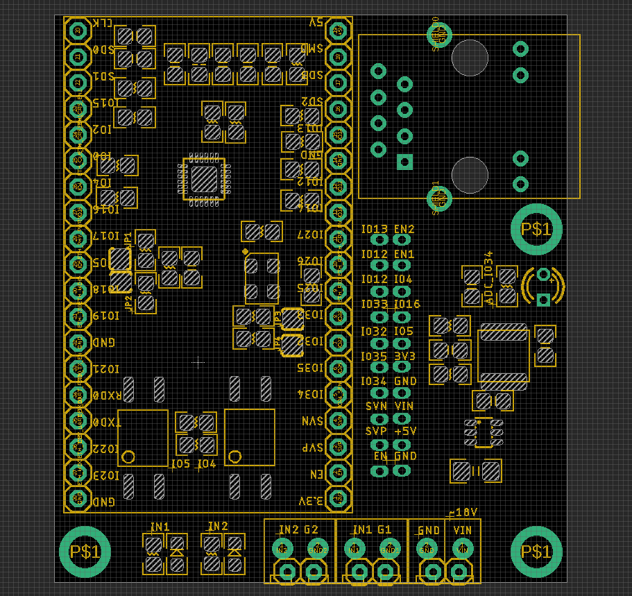

# NWI1200 DAT 

- [[NWI1199-DAT]]

### Hardware 

- Optical Coupler IO4 IO5 

- Sensor Input IO34 

### Ethernet LAN8720 

- Crystal control pin IO2 

- [[LAN8720-DAT]]

## demo code find at 

- [[arduino-code-v2]]

