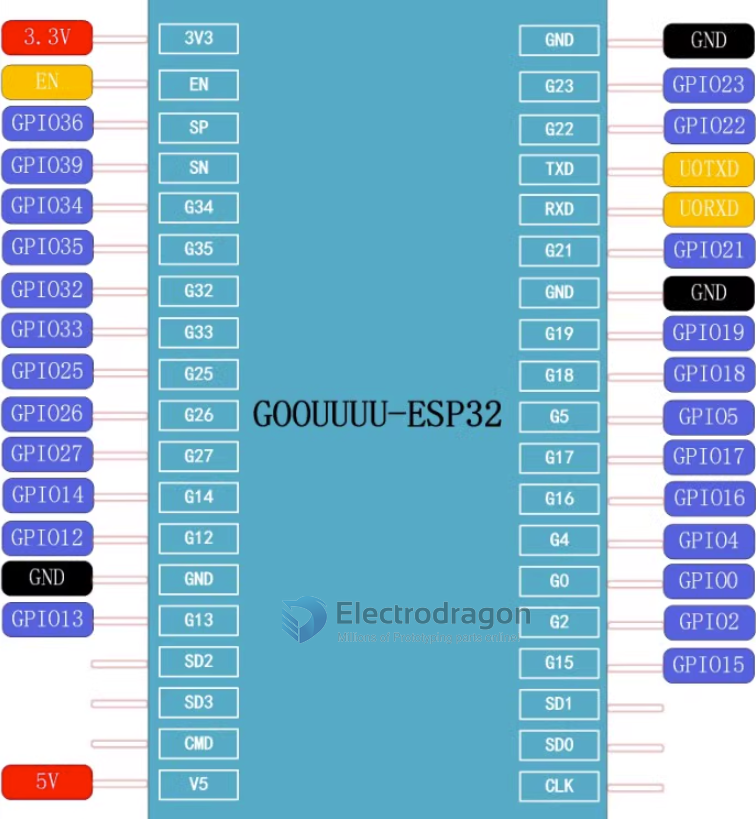
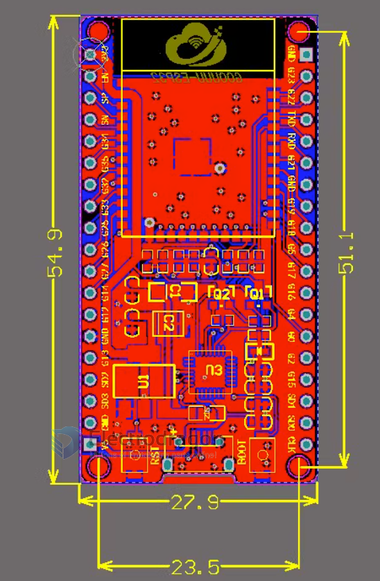
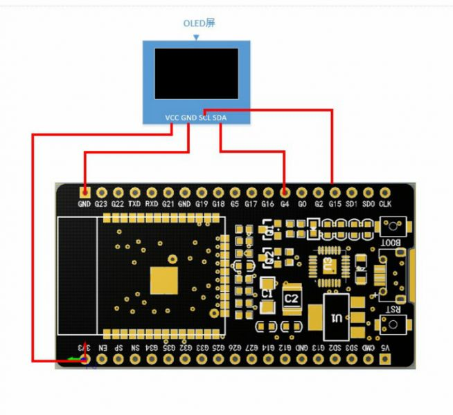

# NWI1206 dat 

- legacy wiki: 

https://w.electrodragon.com/w/ESP32-GOO

## Debug 

When I plug it in the red light briefly flashes but does not detect orshow device ttyUSB0.  USB to Serial Chip CP2102 is probably faulty?
Not sure. Voltage measures 3.3V and 5V, so power is fine but no comms or detection on PC.

For the board issue NWI1206, we had feedback from other users before, they have solved the problem by themselves. 
It could be a problem with the USB, please try a better quality USB-cable, which should be strong enough to transfer the power supply.