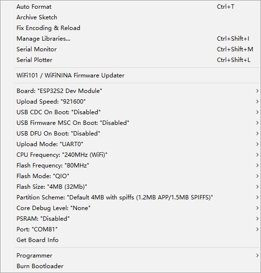

# NWI1235 

## hardware 
- ESP-12K 
    - based on chip ESP32-S2

## Pin Definitions
- WS2812 - IO17 
    - supported by neopixel library 

## Demo 

default tested arduino sketch 
- USB - KeyBoardSerial 
- android detects the board as a physical keyboard 
- send hex bytes instead of utf-8
- https://twitter.com/electro_phoenix/status/1608364149645676544

## PROG Setup 

