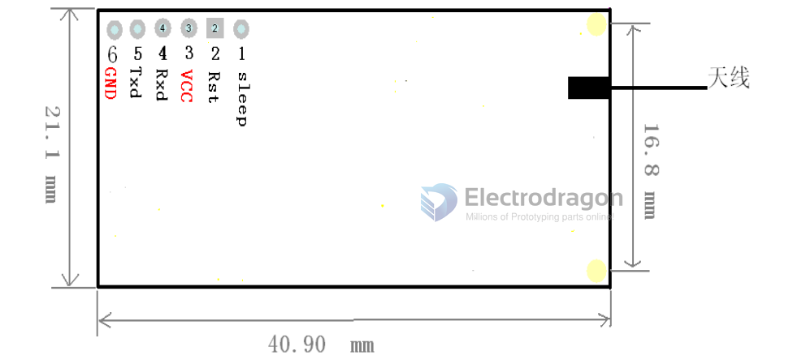

# NWL1039 DAT

CC1101-LUS: Low Power, UART TLL interface, Spring Coil

- [[NWILL42-dat]] is complete same except the atenna 
- with onboard atmega MCU

## Pins

Pin definition from Front View, From left to right

| ! Pins | Definition | Description | connect to               | P.S                               |
| ------ | ---------- | ----------- | ------------------------ | --------------------------------- |
| 1      | Sleep      | Sleep mode  | -                        | This function is not designed yet |
| 2      | Reset      | Reset       | Not necessary to connect | -                                 |
| 3      | VCC        | Power       | +2.7V~5.5V               | Recommended +4.5~+5.5V            |
| 4      | Rx         | Data input  | UART data input          | TTL                               |
| 5      | Tx         | Data output | UART data output         | TTL                               |
| 6      | GND        | GND         | GND                      | -                                 |

### Setting

| Commands                  | Commands + Data | Example                                                                                                                                                                              | note                                                |
| ------------------------- | --------------- | ------------------------------------------------------------------------------------------------------------------------------------------------------------------------------------ | --------------------------------------------------- |
| Set operation frequency   | A7,7A + 00      | send A7 7A 06, the channel will be set to 6                                                                                                                                          | Channel value from 0×00~0xEE, 238 channels in total |
| Set baud rate             | A3, 3A + 01     | send A3 3A 03 set the baud rate to 19200                                                                                                                                             | 01：4800, 02：9600, 03：19200                       |
| Set operation power       | AB,BA + 00      | send AB BA 0A, set the operation transmission power to 10dBM                                                                                                                         | Transmission power can be 0、5、7、10dBM            |
| Set module ID             | A9, 9A + 00 09  | send A9 9A 00 08, set the module ID to 8, this ID are stored in EEPROM                                                                                                               | If the ID need to be converted into hex first       |
| Read module specification | A6, 6A          | send A6, 6A, return A6 00 64 02 0A 00 00 = The initial code returned, Operation channels, Data speed 100Kbps, 02 Means the baud rate is 9600, Transmission Power is 10dBm, Module ID |

- Default settings, Operation channel = 0, Data speed = 100kbps, Baud rate = 9600, Transmission Power = 10mW, Module ID = 00 00
- Note: Send only less than 30 bytes data each time, otherwise it will not succeed 

## ref 

- Github documentation - https://github.com/Edragon/RF-CC1101-RF1100-232

* [[CC1101-DAT]] - [[NWL1042-dat]]
