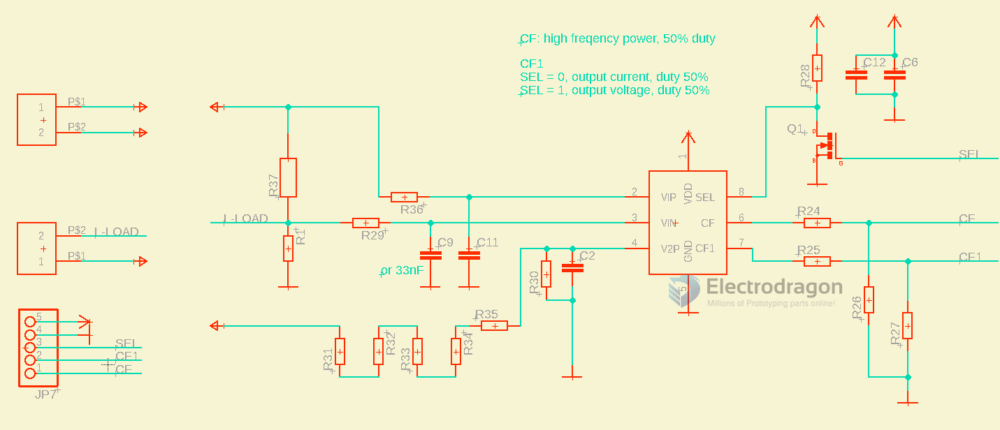

# OPM1126-dat 

## Pin Definitions 

Input Side 

- N: the AC Mains Supply side of the neutral
- L: the AC Mains Supply side of the Live
- L-Load: the measure side of the load of the AC Mains Live
- N: the measure side of the load of the AC mains neutral

Output Side 

- 5V
- GND
- Sel - Configure the effective value output pin with pull-down
- CF1
  - SEL = 0, output current, duty 50%
  - SEL = 1, output voltage, duty 50%
  - indicating current or voltage rms
  - using '''SEL''' selection
  - ± 0.5% accuracy in the 500: 1 range
- CF: output the high freqency of the power use, 50% duty
  - indicating active power
  - in the range of 1000: 1
  - ± 0.3% accuracy

## SCH 

## ref 

- [[HLW8012-dat]] - [[HLW8032-dat]] - [[HLW-dat]] - [[ac-mains-dat]] - [[power-meter-dat]]

Boards - [[OPM1126-dat]]

- [[OPM1126]]