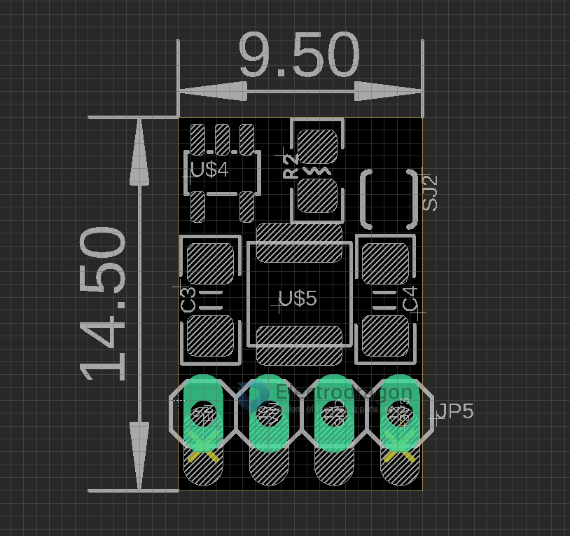

# OPM1134-dat 

## Chip Features: 

- Maximum efficiency: 95%
- Maximum working frequency: 300 KHz
- Low quiescent current: 15uA
- Optional output voltage: 2.5V ～ 3.6V
- Output accuracy: ± 2.5%
- Wide input voltage range: 0.9V ～ 3.6V
- Low ripple and low noise

## Pins 

- enable / VIN / GND / VOUT
- front jumper set enable default ON
- back jumper to connect the LED to power supply

## Applications 

- Electronic equipment with 1 to 2 AA/AAA batteries
- Electronic dictionaries, digital cameras, LED flashlights, LED lights, blood pressure monitors, MP3s, remote control toys, wireless headsets, wireless mice and keyboards, medical equipment, anti-lost devices, car alarms, chargers, VCRs, PDAs and other handheld electronic devices

## ref 

- [[battery-drainer-dat]], demo video here.

- [[battery-drainer]]