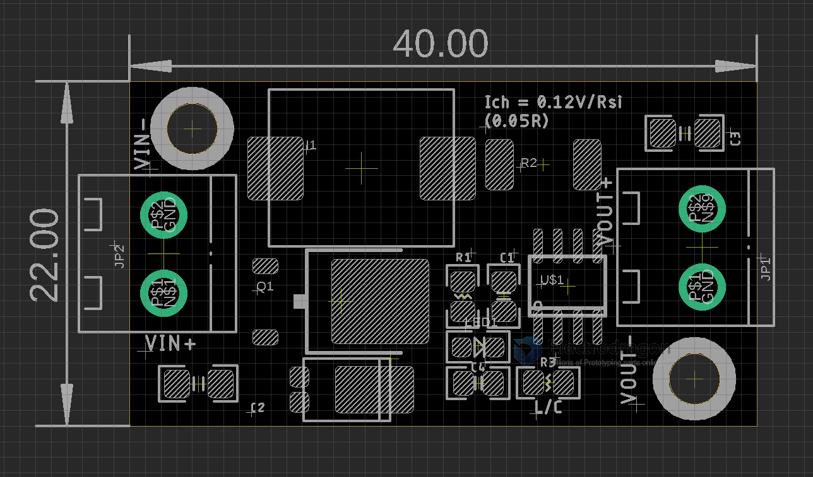

# OPM1181-dat 

## Setup 

0.15V / 0.05 R = 2.4A

## Note 

Notice if you run high charging current, add heat sink on backside would be good.

## Dimension 

## ref

- datasheet - https://github.com/Edragon/Datasheet/tree/master/consonance

- [[rechargeable-battery-dat]] - [[battery-dat]]

- [[Lead-Acid-Battery-dat]]