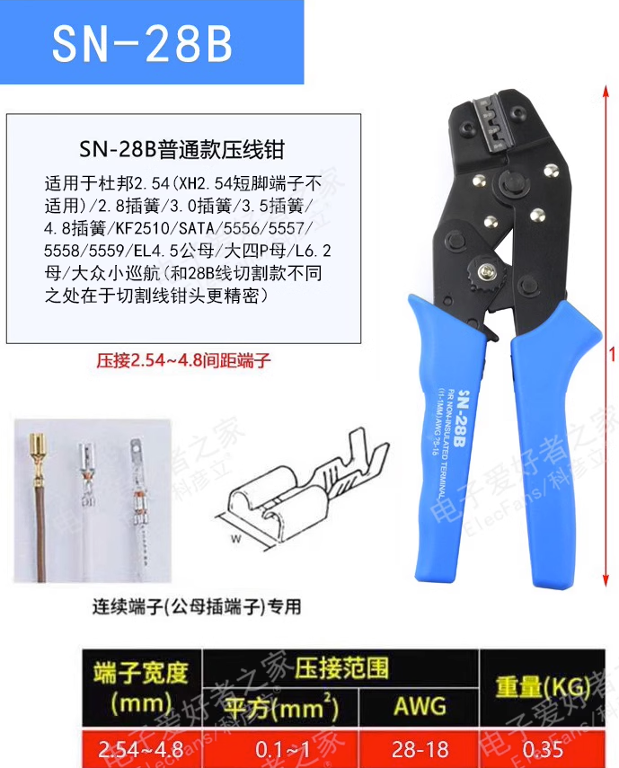

# PTOS032 DAT 

SN-28B: This section Crimping Pliers can pressure 2.5-4.8 spacing (0.1 - 1.0 mm^2), Inlcuding:
- 3.2/3.96/4.8 (common-used)
- KF2510 (common-used)
- DuPont 2.54， 
- 90331 / 43645 / 43020 / 5500 / VH 35156 / 5195 / 5196 / 39612 / FL / 5557 / 42474 / SL / OTP / FL / YL / small EL / QH / NV

Some automotive connection the terminals also can be crimped.