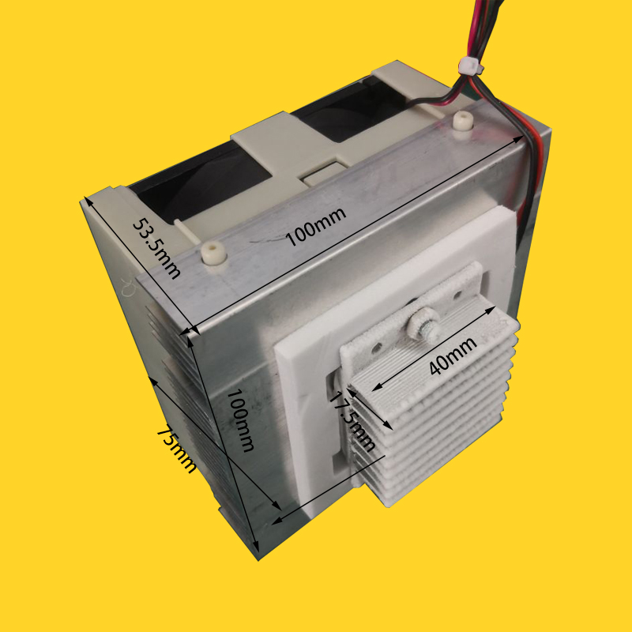
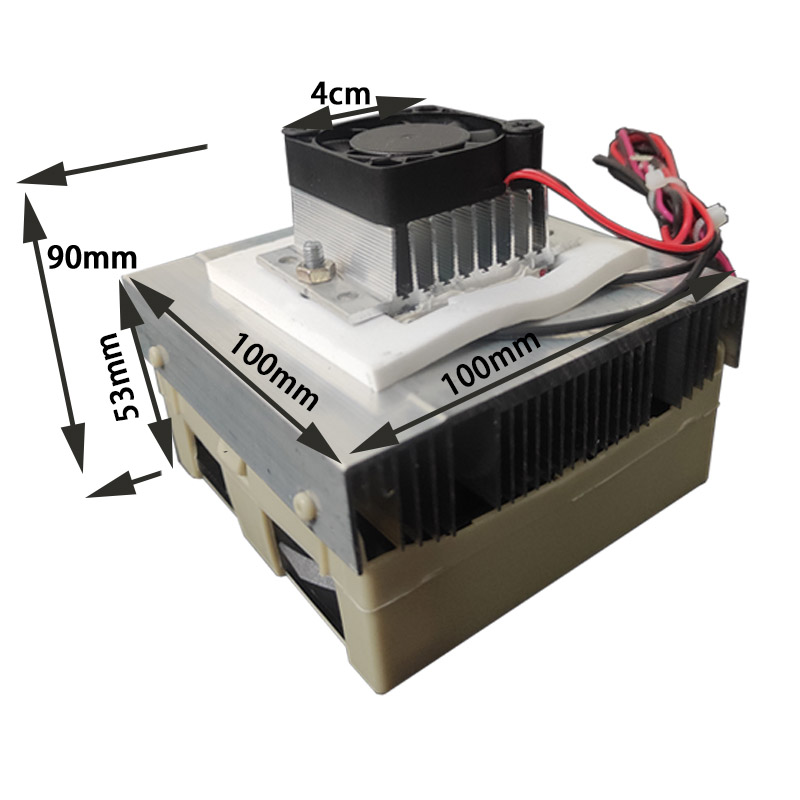
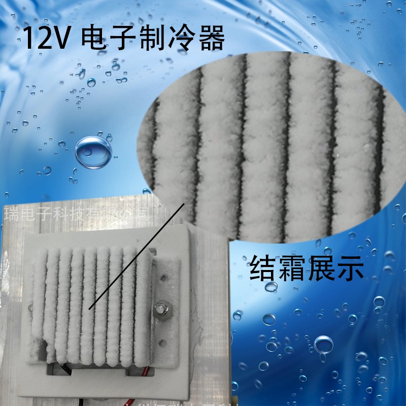

# SCU1038 DAT

## context

## shipingment includes 

- 4010 internal flow fan 
- 9225 external cooling fan
- [[TEC-12706]]
- 10CM heatsink 
- conduction mediator
- screws 
- Thermal Grease
- fan protective cover 
- Thermal insulation cotton

## ref 

- [[cooling]] - [[Peltier]] - [[SCU1038]]