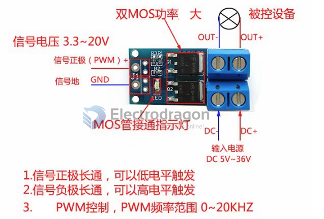

# SDR1073-dat 

### Control Mode 

- Signal + constant ON, trigger by GND
- Signal GND constant ON, trigger by signal + 
- PWM mode, pwm frequency 0 ~ 20Khz 

### legacy wiki page 

- https://w.electrodragon.com/w/Category:Mosfet

### ref 

- [[SDR1073]]