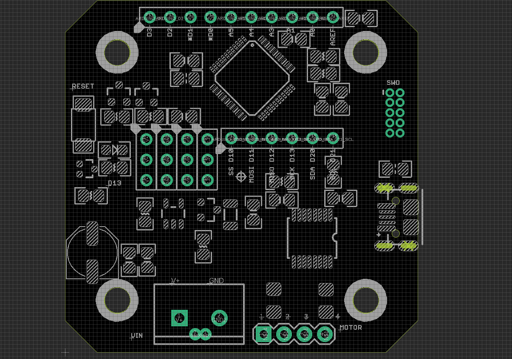

# SDR1096 DAT

## hardware 

### Pin Info 

Middle 4 columns * 3 rows pins, column from left to right : 

- V+: motor power supply 
- GND: ground 
- VIN: USB 5V Input 
- 3V3: 3.3V output from regulator

Other peripheral 
- Programmable LED pin D13 

### main chips 
- [[SAMD21]] - SAMD21G18A-AUT: main controller 

- A4954: motor driver
  - D4 Vref2
  - D5 IN3
  - D6 IN4
  - D7 IN2
  - D8 IN1
  - D9 Vref1

- AS5047D: decoder, provding close-loop feedback
    - D10 SPI_SS
    - D11 SPI_MOSI
    - D12 SPI_MISO
    - D13 SPI_SCK

## ref 
- https://github.com/Misfittech/nano_stepper/
- https://github.com/NiryoRobotics/niryo_stepper
- [[AS5047-DAT]]