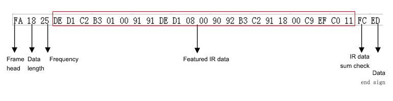

# SIR1015-dat

- [legacy wiki page](https://w.electrodragon.com/w/EDIR)
- more documentation please see legacy wiki page

## Data output

- Standard Three wires serial interface:
- All the data send in HEX format
- return 0xFF for wrong command and 0x00 for correct command

| Sequenc | Date         | Description                                                                            |
| ------- | ------------ | -------------------------------------------------------------------------------------- |
| 1       | Frame Head   | 0xFA, fix value, means the start of data packet                                        |
| 2       | Frame Length | Lenth of data packet, Bytes of Freq+Data                                               |
| 3       | Frequency    | 0x1E ～ 0x3C，frequency 30KHz ～ 60KHz                                                 |
| 4       | Data         | data, length is not fixed, bytes = len -1, maxium 100 bytes, normally only 20-35 bytes |
| 5       | Sum of data  | sum calcultation: 0x100- (Len+Freq+Data0+Data1+…+Datan)                                |
| 6       | End Sign     | 0xED, this is a fixed value                                                            |

## Commands 

- 0xFA, 0xF3 - repeat sending last IR signal data packet
- 0xFA, 0xF4 - exit the data listening mode
- 0xFA, 0xF5 - start the IR signal listening mode, auto exit when data received
- 0xFA, 0xF6 - module reset
- 0xFA, 0xF7 - module wake up
- 0xFA, 0xF8 - enter into sleep mode
- 0xFA, 0xFD - start listening mode with IR integrated receiver, only for frequency at 38Khz
- Data - Send out data as input, direct send decoded signal part as command,  "FA ... ED"

## Note 

- Fixed frequency mode can sense most device, command is FA FD. Audo frequency mode will be much more complex to use.

## Demo 

- [demo video youtube please see here.](https://www.youtube.com/watch?v=Zv19LSpA8Uc&ab_channel=Electrodragon)
- control on/off a fan by infrared controller, by copy and resend the infrared command