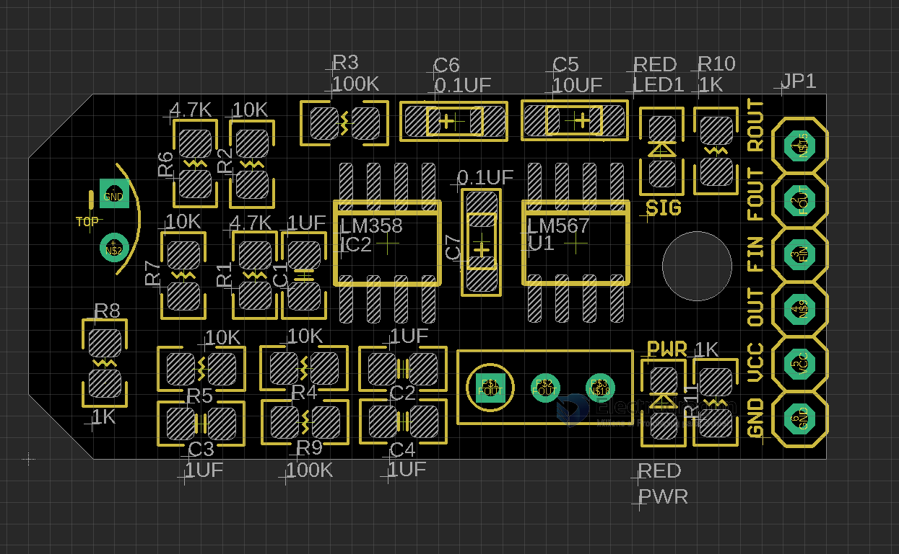
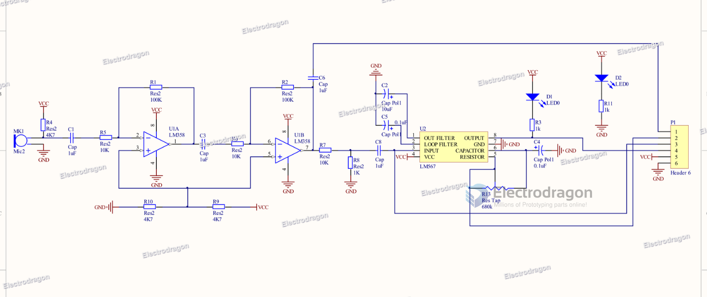

# SSL1027-dat

## Pin Configuration

* GND - GND
* VCC - VCC, 3-12V, DC, use 5V directly is fine
* OUT - output, when detect certain frequency output TTL low
* FIN - Identifier frequency input, this can input the frequency for identifying, be aware the amplification should lower 0.2V
* FOUT - Identifier frequency output pin, this pin output the identifying frequency which is set
* ROUT - Amplifier real time output pin, detect audio amplifier signal real time output.

## Note: 
* make sure VCC and GND is not reverse
* Use adjust resistor, make sure the indicating LED off and then start to use, since there is noise in the environment, so you have to set the noise to a small frequency area.

## Use Guide 

1. Power up, power LED up
2. Choose and use a fixed voice source, which is the one for identifying, keep it continuously output. use phone app, recommanded 500KHZ, less noise to ear.
3. tuning trim pot, until singal indication LED on 
    - counter clockwise turn for high HZ, clockwise turn for low HZ
    - the trim pot has no stop, and reach limit after 15 turns, so when you turn 15 turns, try reverse direction.
    - trim pot only reach the frequency in a very small range, and LED on
    - Do not turn too fast, and keep close to sound source, otherwise can miss the frequency.
    - keep microphone board close to sound source
4. turn off sound source, Signal indicating LED off, now the calibrating is finish. 

Note: Suggest to use the software called 
* audioSCSI which can output a fixed frequency on PC end
* Audio test ton generater or frequncy sound generator on android.

## Schematic 

## Legacy wiki page 

https://w.electrodragon.com/w/LM567

## Demo 
- https://www.youtube.com/watch?v=ChL9mMirgk4
- https://twitter.com/electro_phoenix/status/1497890295253389314
- https://t.me/electrodragon3/215

## Old Logs 

https://twitter.com/electro_phoenix/status/1001750412347650048

- [[SSL1027]] - [[LM567-dat]]