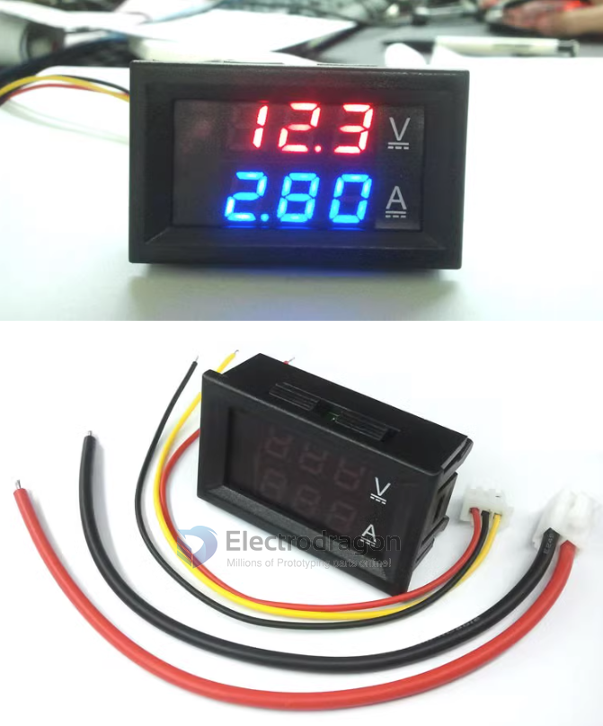

# SVC1015 DAT 

## Info 

- [legacy wiki page](https://w.electrodragon.com/w/Voltmeter_Ammeter)

- Voltage measurement range 0.0V-100V
- Current test range 0-10A
- Power supply range DC4-30.0V (if the voltage exceeds 30V, an external independent power supply is required)

## Shunt 

Note: There is a meter with a shunt. The two thick red wires on the meter must be connected to the thin screws of the shunt. The negative pole of the power supply and the negative pole of the load must be connected to the thick screws of the shunt.

## FAQ 

The following summary is made for reference based on various questions that customers frequently ask:

Note: A meter with a measuring range of 50A or 100A must be connected to a shunt to measure current regardless of whether the measured current is less than 10A! Otherwise, the meter head will be burned out.

The voltage display is normal and the current display is 0.00 or 0.0
Make sure the thick black wire is connected to the negative terminal of the battery and the thick red wire is connected to the negative terminal of the load. (Note that the wiring for discharging and charging are different, see the concepts of load and power supply at the end). (The meter uses an original imported chip. It undergoes very strict testing and calibration before leaving the factory to ensure that there are 100% no quality problems before leaving the factory. If the current shows 0, 99.99% of the time it is due to incorrect wiring. Please be patient and check the wiring carefully)

### Current display is inaccurate

If it is a direct power supply or an independent power supply and the device power supply share the same ground, just disconnect the thin black wire and it will be accurate.

### No display when connected to power

All rectified alternating current must be filtered by an electrolytic capacitor of more than 1000uF before powering the meter.

### Determine whether the meter header is good or bad (the following are two situations of normal meter headers)

Without connecting the shunt, connect the thin red wire and the thin black wire to the power supply. The meter with a measuring range of 50A displays 50.0~59.9, and the meter with a measuring range of 100A displays 100~109;

Connect the shunt, and connect the thin red wire and the thin black wire to the power supply. The current of the meter with a measuring range of 50A displays 0.00, and the current of the meter with a measuring range of 100A displays 0.0;

### Other things to note

Measuring current can only be done in series with the negative pole of the power supply and the negative pole of the load.

Voltage range: The power supply voltage range of the 5-wire meter is 4~28V, that is, the voltage connected to the thin red wire cannot exceed 28V.

### About the concept of load and power supply

When discharging: batteries, switching power supplies, and transformers are power sources, and resistors, lights, motors, and electrical equipment are loads.

When charging: chargers, generators, and solar energy are the power sources, and rechargeable batteries and storage batteries are the loads.

## ref 

- [[svc1015-dat]] - [[svc1017-dat]] - [[svc1019-dat]]