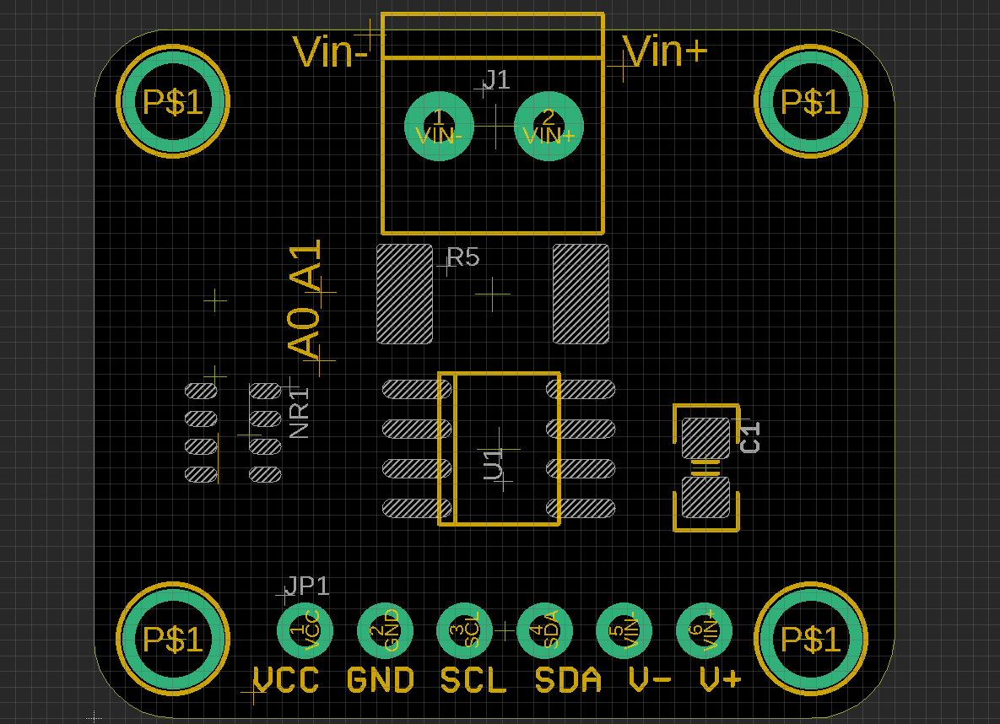

# SVC1027 DAT 

## while no inputs 

serial output 

    Bus Voltage:   1.01 V
    Shunt Voltage: -0.05 mV
    Load Voltage:  1.01 V
    Current:       -0.50 mA
    Power:         0.00 mW

- [[INA219-DAT]] - [[I2C-dat]]

- [[power-meter-dat]]

- [[SVC1027]]